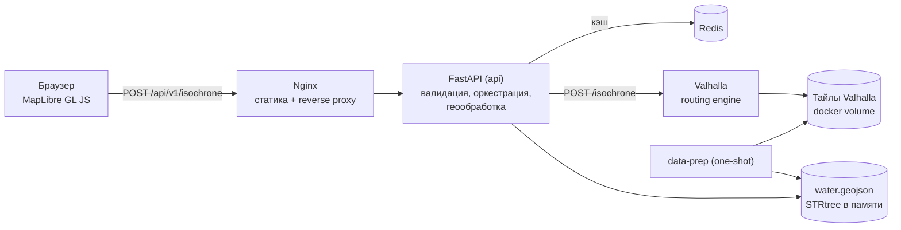

# isochrone-service

Сервис расчёта зон досягаемости (изохрон) на открытых данных OpenStreetMap и открытом
роутинг-движке Valhalla. Отвечает на вопрос «куда можно добраться отсюда за N минут»
пешком, на велосипеде или на автомобиле и возвращает результат в виде валидного
GeoJSON FeatureCollection.

Весь контур расчёта — самодостаточный: ни один платный внешний API (Google, Mapbox,
2ГИС, Яндекс) не используется. Данные OSM скачиваются и препроцессятся автоматически при
первом запуске, дальше сервис работает полностью локально. В комплекте — демо-страница
с картой на MapLibre GL JS для визуальной проверки результата.


> Скриншот снимается со страницы `http://localhost:8080` после первого успешного расчёта
> и кладётся в `docs/screenshot.png`.

---

## 1. Требования к окружению

| Ресурс | Минимум | Комментарий |
|---|---|---|
| Docker Engine | 24+ | нужен `docker compose` v2 |
| CPU | 4 vCPU | сборка тайлов распараллеливается |
| RAM | 8 ГБ | пик приходится на `valhalla_build_tiles` |
| Диск | 12 ГБ свободно для профиля `almaty` | исходный PBF Казахстана + тайлы + образы |
| Сеть | доступ к `download.geofabrik.de`, `ghcr.io`, `docker.io`, `unpkg.com` | загрузка данных и сборка образов |

Профили `almaty-region` и `kazakhstan` требуют больше диска и RAM, см. раздел 7.

## 2. Быстрый старт

```bash
git clone <repo> && cd isochrone-service
cp .env.example .env
docker compose up -d
```

Больше ничего делать не нужно: PBF скачается, bbox вырежется, слой воды построится, тайлы
Valhalla соберутся автоматически.

Проверка готовности:

```bash
curl -s localhost:8080/api/v1/ready | python3 -m json.tool
```

Пока идёт первичная сборка тайлов, `/ready` отвечает `503`, а `/api/v1/isochrone` —
`503 ENGINE_UNAVAILABLE` с понятным `detail`. Это ожидаемое поведение, сервис не падает.

Демо-страница: <http://localhost:8080>
Swagger UI: <http://localhost:8080/api/v1/docs>

## 3. Первичная сборка: сколько ждать и как следить

Порядок первого запуска:

1. `data-prep` — скачивает исходный PBF Geofabrik по Казахстану, вырезает bbox профиля,
   строит `data/water.geojson` и `data/meta.json`, затем завершает работу с кодом 0.
2. `valhalla` — собирает тайлы из подготовленного экстракта и начинает их обслуживать.
3. `api` и `web` — стартуют сразу, до готовности движка отвечая `503 ENGINE_UNAVAILABLE`.

Ориентировочное время на эталонной конфигурации (4 vCPU, 8 ГБ RAM, SSD, Linux, нативный
Docker):

| Профиль | Скачивание | Вырезка bbox + вода | Сборка тайлов | Итого без скачивания |
|---|---|---|---|---|
| `almaty` | зависит от канала, 211 МБ | 10 с | 45 с | **60 с** |
| `almaty-region` | зависит от канала, 211 МБ | *(не измерялось)* | *(не измерялось)* | *(не измерялось)* |
| `kazakhstan` | зависит от канала, 211 МБ | *(не измерялось)* | *(не измерялось)* | *(не измерялось)* |

> Замер `almaty` сделан 2026-08-10 на стенде AMD Ryzen 5 3500U (4 ядра / 8 потоков),
> 13 ГБ RAM, NVMe SSD, Linux, Docker 29.7.2 в нативном режиме: `docker volume rm
> isochrone_valhalla_tiles` → `docker compose up -d`. Отсчёт от `up` до перехода движка
> в `ready`; контейнер `api` при этом принимает запросы уже через 14 с и до готовности
> движка отвечает `503 ENGINE_UNAVAILABLE`. Скачивание в этот прогон не входило — исходный
> PBF лежал в volume `osm_source`, как и при обычном `docker compose down && up`.
>
> Исходная выгрузка Казахстана скачивается один раз и не зависит от профиля: вырезка bbox
> делается локально. Чтобы не качать страну целиком, укажите `OSM_EXTRACT_URL` на готовый
> мелкий экстракт. Строки `almaty-region` и `kazakhstan` заполняются при переходе на эти
> профили — на стенде исполнителя они не собирались.

Следить за прогрессом:

```bash
docker compose logs -f data-prep     # загрузка PBF, вырезка bbox, слой воды
docker compose logs -f valhalla      # сборка тайлов
docker compose ps                    # состояния и healthcheck
```

Признак готовности: `curl -s -o /dev/null -w '%{http_code}' localhost:8080/api/v1/ready`
возвращает `200`.

Повторные `docker compose down && docker compose up -d` тайлы **не пересобирают**: и тайлы,
и исходный PBF лежат в именованных volume, а `data-prep` при совпадении `data_version`
завершается мгновенно.

## 4. Проверка работоспособности

Smoke-тест целиком:

```bash
./scripts/smoke_test.sh          # ненулевой код возврата при любой неудаче
```

Ниже — примеры запросов по каждому эндпоинту. Полный сценарий проверки, включая
нагрузочные прогоны, поведение при остановленном Redis и движке, первичную сборку тайлов и
ручной обход демо-страницы, — в [docs/verification-guide.md](docs/verification-guide.md).

### Liveness

```bash
$ curl -s localhost:8080/api/v1/health
{"status":"ok","version":"1.0.0"}
```

### Readiness

```bash
$ curl -s localhost:8080/api/v1/ready | python3 -m json.tool
{
    "status": "degraded",
    "components": {
        "engine": "ok",
        "cache": "unavailable",
        "water_layer": "ok",
        "dataset": "ok"
    },
    "detail": "Кэш недоступен, запросы обрабатываются без кэширования."
}
```

Эндпоинт отвечает на вопрос «можно ли направлять сюда трафик», а не «все ли зависимости
в норме». `503` возвращается только при недоступном движке. Отказ кэша, отсутствие слоя
воды или метаданных дают `200` со `status: "degraded"` — сервис продолжает считать
изохроны, теряя только скорость. Система мониторинга различает `ok` и `degraded` по телу
ответа, оркестратор — по HTTP-коду.

### Метаданные покрытия

```bash
$ curl -s localhost:8080/api/v1/meta | python3 -m json.tool | head -20
{
    "service": "isochrone-service",
    "version": "1.0.0",
    "engine": "valhalla",
    "engine_version": "3.5.1",
    "modes": ["pedestrian", "bicycle", "auto"],
    "osm_data_timestamp": "2026-05-01T00:00:00Z",
    "data_version": "9f1c2b7e...",
    "coverage": {
        "profile": "almaty",
        "bbox": [76.6, 43.05, 77.2, 43.45],
        ...
```

### Основной расчёт

```bash
curl -s -X POST localhost:8080/api/v1/isochrone \
  -H 'Content-Type: application/json' \
  -d '{
        "lat": 43.238949,
        "lon": 76.889709,
        "contours": [10, 20, 30],
        "mode": "pedestrian",
        "options": {"rings": false, "exclude_water": true}
      }' | python3 -m json.tool
```

Ответ (геометрия сокращена):

```json
{
  "type": "FeatureCollection",
  "features": [
    {
      "type": "Feature",
      "geometry": {"type": "Polygon", "coordinates": [[[76.920068, 43.235049], "..."]]},
      "properties": {
        "contour_minutes": 30,
        "mode": "pedestrian",
        "color": "#2b83ba",
        "fill_opacity": 0.25,
        "area_km2": 18.42,
        "perimeter_km": 27.9,
        "rings": false,
        "engine": "valhalla",
        "engine_version": "3.5.1",
        "osm_data_timestamp": "2026-05-01T00:00:00Z",
        "computed_at": "2026-08-09T10:15:32+00:00",
        "request_id": "01J9X2K7Q4T8Z0ABCDEFGHJKMN",
        "cache": "miss"
      }
    },
    {"type": "Feature", "properties": {"contour_minutes": 20, "color": "#abdda4", "...": "..."}, "geometry": {}},
    {"type": "Feature", "properties": {"contour_minutes": 10, "color": "#fdae61", "...": "..."}, "geometry": {}}
  ],
  "metadata": {
    "request_id": "01J9X2K7Q4T8Z0ABCDEFGHJKMN",
    "origin": {"lat": 43.238949, "lon": 76.889709},
    "snapped_origin": {"lat": 43.23891, "lon": 76.889602},
    "snap_distance_m": 12.4,
    "mode": "pedestrian",
    "contours": [10, 20, 30],
    "rings": false,
    "exclude_water": true,
    "denoise": 0.2,
    "generalize": 100,
    "engine": "valhalla",
    "engine_version": "3.5.1",
    "osm_data_timestamp": "2026-05-01T00:00:00Z",
    "data_version": "9f1c2b7e...",
    "computed_at": "2026-08-09T10:15:32+00:00",
    "duration_ms": 812,
    "engine_ms": 690,
    "cache": "miss"
  }
}
```

Ответ содержит заголовки `X-Request-Id` и `X-Cache: MISS|HIT`, тип содержимого —
`application/geo+json`.

### GET-вариант для шаринга ссылок

```bash
curl -s 'localhost:8080/api/v1/isochrone?lat=43.238949&lon=76.889709&contours=10,20,30&mode=auto&rings=true' \
  -o isochrone.geojson
```

### Ошибки (RFC 7807)

```bash
$ curl -s -X POST localhost:8080/api/v1/isochrone -H 'Content-Type: application/json' \
    -d '{"lat":51.1605,"lon":71.4704,"contours":[10],"mode":"auto"}'
{
  "type": "https://isochrone.local/errors/point-out-of-coverage",
  "title": "Point is out of coverage",
  "status": 422,
  "detail": "Точка (51.160500, 71.470400) находится вне покрытия загруженных данных OSM. Профиль 'almaty', bbox 76.6, 43.05, 77.2, 43.45.",
  "instance": "/api/v1/isochrone",
  "request_id": "01J9X2K7Q4T8Z0ABCDEFGHJKMN",
  "code": "POINT_OUT_OF_COVERAGE"
}
```

```bash
$ curl -s -X POST localhost:8080/api/v1/isochrone -H 'Content-Type: application/json' \
    -d '{"lat":43.238949,"lon":76.889709,"contours":[61],"mode":"auto"}'
{"type":"https://isochrone.local/errors/validation-error","title":"Request validation failed",
 "status":400,"detail":"contours.0: Input should be less than or equal to 60", ...,
 "code":"VALIDATION_ERROR"}
```

### Метрики

```bash
curl -s localhost:8080/metrics | grep isochrone_
```

## 5. Переменные окружения

Полный перечень с комментариями — в `.env.example`. Ключевые:

| Переменная | По умолчанию | Описание |
|---|---|---|
| `COMPOSE_PROJECT_NAME` | `isochrone` | Префикс имён контейнеров и volume |
| `OSM_PROFILE` | `almaty` | Профиль покрытия: `almaty` \| `almaty-region` \| `kazakhstan` |
| `OSM_EXTRACT_URL` | — | Прямая ссылка на PBF, переопределяет источник профиля |
| `OSM_FORCE_REFRESH` | `false` | Перекачать исходный PBF даже при наличии в volume |
| `COVERAGE_BBOX` | — | Переопределение bbox покрытия, формат `W,S,E,N` |
| `WATER_MIN_AREA_M2` | `5000` | Минимальная площадь учитываемого водоёма |
| `WATER_RIVER_WIDTH_M` / `WATER_STREAM_WIDTH_M` / `WATER_CANAL_WIDTH_M` | `15` / `4` / `10` | Ширина буфера линейных водотоков без тега `width` |
| `WATER_INCLUDE_CANALS` | `true` | Учитывать каналы (`waterway=canal`, в т.ч. БАК) как барьеры |
| `VALHALLA_URL` | `http://valhalla:8002` | Адрес движка |
| `VALHALLA_SERVER_THREADS` | `4` | Рабочие потоки движка |
| `VALHALLA_MAX_DISTANCE_CONTOUR_KM` | `200` | `service_limits.isochrone.max_distance_contour` |
| `REDIS_URL` | `redis://redis:6379/0` | Адрес кэша |
| `CACHE_TTL_SECONDS` | `604800` | TTL кэша, 7 суток |
| `CACHE_COORD_PRECISION` | `4` | Округление координат в ключе кэша (4 знака ≈ 11 м) |
| `REDIS_CONNECT_TIMEOUT_MS` | `150` | Таймаут установки соединения с Redis |
| `REDIS_BREAKER_THRESHOLD` / `REDIS_BREAKER_COOLDOWN_S` | `3` / `30` | Circuit breaker кэша: неудач подряд до размыкания и пауза до пробной попытки |
| `ENGINE_TIMEOUT_S` | `10` | Таймаут чтения ответа движка |
| `ENGINE_CONNECT_TIMEOUT_S` | `1` | Таймаут установки соединения с движком |
| `ENGINE_POLL_INTERVAL_S` | `5` | Интервал фоновой проверки готовности движка |
| `ENGINE_FAILURE_THRESHOLD` | `3` | Сколько подряд неудачных проверок `/status` переводят движок в `unavailable` |
| `ENGINE_WARMUP_CONNECTIONS` | `8` | Сколько соединений с движком открывается при старте, чтобы первая волна запросов не платила за установку |
| `GEOMETRY_WORKERS` | `0` | Размер пула потоков для постобработки геометрии, `0` — число ядер CPU минус два |
| `WATER_SIMPLIFY_TOLERANCE_DEG` | `0.00003` | Упрощение слоя воды при загрузке, градусы; `0` отключает |
| `MAX_CONTOURS` | `4` | Максимум контуров в запросе |
| `MIN_CONTOUR_MINUTES` / `MAX_CONTOUR_MINUTES` | `5` / `60` | Границы времени контура |
| `MAX_SNAP_DISTANCE_M` | `500` | Порог отсечения нероутируемых точек |
| `MAX_BODY_SIZE` | `16384` | Максимальный размер тела запроса, байт |
| `RATE_LIMIT` / `RATE_LIMIT_BURST` | `10/second` / `20` | Лимит запросов на IP |
| `EXCLUDE_WATER_DEFAULT` / `RINGS_DEFAULT` | `true` / `false` | Значения опций по умолчанию |
| `CORS_ORIGINS` | `*` | Разрешённые origin |
| `LOG_LEVEL` | `INFO` | Уровень логирования |
| `API_PORT` / `WEB_PORT` | `8000` / `8080` | Порты (наружу публикуется только `WEB_PORT`) |
| `BASEMAP_TILE_URL` / `BASEMAP_ATTRIBUTION` | тайлы OSM | Подложка демо-страницы |

## 6. Режимы запуска

```bash
make up      # прод-профиль: наружу только порт web
make dev     # hot-reload uvicorn, монтирование исходников, порты наружу
make debug   # прод-профиль + порты valhalla/redis/api на 127.0.0.1
make down    # остановить, данные и тайлы сохраняются
make clean   # остановить и удалить volume
make help    # все цели
```

Dev-профиль лежит в `docker-compose.dev.yml` и подключается **только явным перечислением
файлов**. Имя `docker-compose.override.yml` намеренно не используется: такой файл Compose
подхватывает автоматически, и обычный `docker compose up -d` публиковал бы наружу порты
`api`/`valhalla`/`redis` (нарушение AC-18). Небезопасная конфигурация должна быть
недостижима, а не отключаться переменной в `.env`, которую легко забыть скопировать.

```bash
make dev
# то же самое вручную:
docker compose -f docker-compose.yml -f docker-compose.dev.yml up -d
```

## 7. Как сменить регион покрытия

Профили и их bbox:

| Профиль | bbox (`W,S,E,N`) | Ориентировочный объём экстракта |
|---|---|---|
| `almaty` | `76.60,43.05,77.20,43.45` | ~40–80 МБ |
| `almaty-region` | `75.80,42.60,78.60,44.60` | ~150–250 МБ |
| `kazakhstan` | вся страна | ~700 МБ – 1.2 ГБ |

```bash
# 1. поменять профиль
sed -i 's/^OSM_PROFILE=.*/OSM_PROFILE=almaty-region/' .env

# 2. пересобрать данные и тайлы
make update-data
```

Произвольный регион: укажите `OSM_EXTRACT_URL` на нужную выгрузку Geofabrik и
`COVERAGE_BBOX` на его границы, затем `make update-data`.

## 8. Как обновить данные OSM

Автоматического обновления по расписанию нет — это вне объёма работ. Ручная процедура:

```bash
docker compose down
docker volume rm isochrone_valhalla_tiles isochrone_osm_source isochrone_app_data
docker compose up -d          # свежий PBF, новый слой воды, пересборка тайлов
```

То же самое одной командой: `make update-data`.

Дата среза данных фиксируется при подготовке и возвращается в
`metadata.osm_data_timestamp` и `/api/v1/meta`. Она же входит в `data_version`, поэтому
кэш инвалидируется автоматически: старые ответы после обновления данных не отдаются.

## 9. Архитектура



| Сервис | Роль | Порт наружу |
|---|---|---|
| `data-prep` | одноразовая подготовка данных: PBF, вырезка bbox, слой воды, метаданные | — |
| `valhalla` | роутинг-движок, сборка и обслуживание тайлов | — |
| `redis` | кэш результатов | — |
| `api` | FastAPI: валидация, кэш, вызов движка, геообработка, метрики | — |
| `web` | Nginx: статика демо-страницы и reverse proxy на `/api` и `/metrics` | `8080` |

Подробное обоснование решений — в [docs/ARCHITECTURE.md](docs/ARCHITECTURE.md).
Спецификация API — [docs/openapi.yaml](docs/openapi.yaml) и живой Swagger UI на
`/api/v1/docs`.

## 10. Известные ограничения

1. **Точность на узких барьерах.** Изохрона строится интерполяцией по сетке стоимости, а не
   заливкой по графу. Небольшое «протекание» через узкие препятствия — свойство метода.
   Оно подавляется тремя механизмами: параметрами `denoise`/`generalize`, вычитанием
   площадных водоёмов и буферизацией линейных водотоков. Приёмка ведётся по критерию
   визуальной корректности на контрольных точках, а не по попиксельному соответствию.
2. **Какие барьеры вычитаются.** Площадные объекты `natural=water`, `waterway=riverbank`,
   `landuse=reservoir|basin`; линейные `waterway=river|stream|canal`, забуферизованные по
   тегу `width` либо по значению из конфига. Железнодорожные насыпи и обрывы
   (`natural=cliff`) **не** вычитаются намеренно: в городской черте они пересекаются
   переездами, мостами и тропами достаточно часто, и вычитание давало бы ложные разрывы
   зоны. Список тегов расширяется в `scripts/prepare_water.sh` без изменения кода API.
3. **Водоёмы меньше `WATER_MIN_AREA_M2` (по умолчанию 5000 м²) игнорируются** — они не
   влияют на визуальную корректность, но заметно замедляют обработку.
4. **`auto` на 60 минут — самый тяжёлый сценарий:** зона выходит далеко за пределы
   агломерации. Норматив 3 с гарантируется для профиля `almaty`. На `almaty-region` и
   особенно `kazakhstan` он может не выдерживаться; ограничивайте
   `VALHALLA_MAX_DISTANCE_CONTOUR_KM` и увеличивайте `VALHALLA_SERVER_THREADS`.
5. **Пробки и исторические скорости не учитываются.** Расчёт идёт по свободному потоку.
   Параметр `options.departure_time` принимается и передаётся движку как `date_time.type=1`,
   но без traffic-данных на результат он практически не влияет.
6. **Общественный транспорт не поддерживается** (нет GTFS, нет режима `multimodal`).
7. **Один Feature на контур — если геометрия непустая.** Если движок не смог построить
   какой-то контур, этот Feature пропускается, а в лог пишется предупреждение
   `contours_without_geometry`. Пустые геометрии в ответ не попадают, чтобы файл
   гарантированно открывался в QGIS.
8. **Tile usage policy OSM.** Демо-страница по умолчанию использует публичные тайлы
   `tile.openstreetmap.org`. Это допустимо **только для демо-стенда**. Публичные тайлы
   OSM — не бесплатный CDN: см. <https://operations.osmfoundation.org/policies/tiles/>.
   Для продуктивной эксплуатации поднимите собственный сервер подложки или возьмите
   коммерческий источник и подставьте его в `BASEMAP_TILE_URL`.
9. **Аутентификации и квот нет.** Есть только rate limiting по IP. Публиковать сервис в
   интернет без внешнего шлюза авторизации не следует.
10. **Rate limit считается в памяти процесса API.** При масштабировании API в несколько
    реплик лимит станет пореплиным; для общего лимита понадобится счётчик в Redis.

## 11. Troubleshooting

**Сборка тайлов падает по памяти (OOM, контейнер `valhalla` перезапускается).**
Уменьшите профиль до `almaty`, уменьшите `VALHALLA_SERVER_THREADS` (каждый поток держит
свой буфер), дайте Docker больше RAM. На Docker Desktop лимит задаётся в настройках,
на Linux — доступной памятью хоста. Проверить: `docker compose logs valhalla | tail -50`.

**После старта всё отвечает `503 ENGINE_UNAVAILABLE`.**
Это нормально, пока идут скачивание и сборка. Смотрите `docker compose logs -f data-prep`
и `docker compose logs -f valhalla`. Если `data-prep` завершился с ошибкой, стек не
поднимется дальше: `docker compose ps -a` покажет его код возврата.

**Первый запрос медленный, последующие быстрые.**
Ожидаемо: первый запрос прогревает пул соединений и попадает мимо кэша. Кэш живёт 7 суток,
ключ округляет координаты до 4 знаков (≈ 11 м).

**`docker compose up` каждый раз пересобирает тайлы.**
Значит, volume не переживает перезапуск. Проверьте, что не используется `docker compose
down -v`, и что `data-prep` находит совпадающий `data_version`:
`docker compose logs data-prep | grep data_version`.

**Порт 8080 занят.** Поменяйте `WEB_PORT` в `.env` и перезапустите стек.

**Apple Silicon (macOS arm64).** Образ `ghcr.io/gis-ops/docker-valhalla/valhalla:3.5.1`
собран под `linux/amd64` и `linux/arm64`, отдельных действий не требуется. Если Docker
всё же выбрал эмуляцию, сборка тайлов замедляется в разы — проверьте
`docker image inspect ghcr.io/gis-ops/docker-valhalla/valhalla:3.5.1 --format '{{.Architecture}}'`
и при необходимости запустите с `--platform linux/arm64`. Собирать тайлы под эмуляцией
QEMU не рекомендуется: используйте Linux-стенд.

**Redis остановлен.** Сервис продолжает работать: в лог один раз пишется `cache_unavailable`
с уровнем `warning` (не на каждый запрос), `/ready` показывает `cache: unavailable` со
`status: degraded` и кодом `200`, ответы считаются каждый раз заново. Соединение с Redis
ограничено `REDIS_CONNECT_TIMEOUT_MS` (150 мс), а после `REDIS_BREAKER_THRESHOLD` неудач
подряд кэш исключается из обработки на `REDIS_BREAKER_COOLDOWN_S` — время ответа при
мёртвом Redis не растёт. При возврате Redis в строй пишется `cache_recovered`.

**Слой воды пуст (`water_parts: 0`).** Посмотрите `docker compose logs data-prep`: скорее
всего, `osmium tags-filter` не нашёл объектов в выбранном bbox или упал `ogr2ogr`.
Сервис при этом работает, но `exclude_water` фактически ничего не вырезает.

## 12. Разработка

```bash
make venv          # окружение Python 3.12 в api/.venv
make lint          # ruff check
make fmt           # ruff format
make test-unit     # unit-тесты + порог покрытия 70 %
make test-contract # schemathesis по сгенерированной OpenAPI-схеме
make openapi       # выгрузить docs/openapi.yaml
make up && make smoke
make test-integration
make load-test     # k6: 10 RPS × 5 мин
make load-test-degraded  # тот же прогон при остановленном Redis (AC-12 вместе с AC-09)
```

`load-test-degraded` проверяет AC-12 так, как того требует ТЗ: изолированная проверка
«вернулся 200» пропускает деградацию по времени из-за таймаутов клиента Redis, поэтому
нормативы п. 10.2 подтверждаются на прогоне с выключенным кэшем.

Пошаговый сценарий проверки — от линтера до отказа зависимостей и первичной сборки
тайлов, с ожидаемыми результатами и эталонными цифрами — в
[docs/verification-guide.md](docs/verification-guide.md).

Структура репозитория и назначение модулей описаны в
[docs/ARCHITECTURE.md](docs/ARCHITECTURE.md), чек-лист приёмки —
в [docs/acceptance-checklist.md](docs/acceptance-checklist.md).

## 13. Лицензии и атрибуция

- **Данные** — © участники OpenStreetMap, лицензия
  [ODbL 1.0](https://opendatacommons.org/licenses/odbl/1-0/). Любая публикация карт и
  производных данных обязана содержать атрибуцию «© OpenStreetMap contributors».
- **Valhalla** — MIT License, <https://github.com/valhalla/valhalla>.
- **Docker-образ Valhalla** — <https://github.com/nilsnolde/docker-valhalla> (ранее
  gis-ops), MIT.
- **MapLibre GL JS** — BSD-3-Clause, <https://github.com/maplibre/maplibre-gl-js>.
- **Тайлы подложки** — `tile.openstreetmap.org`, использование ограничено
  [tile usage policy](https://operations.osmfoundation.org/policies/tiles/).
- **Osmium Tool** — GPL-3.0, **GDAL/OGR** — MIT-style, **Shapely/pyproj** — BSD.
