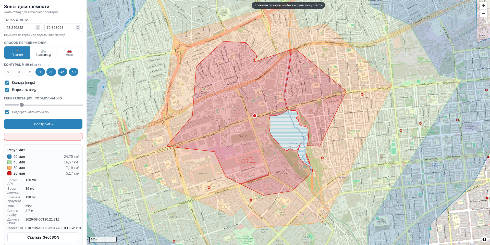
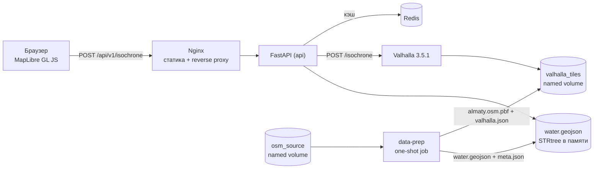

# isochrone-service



Self-hosted isochrone (reachability) service built on OpenStreetMap data and the Valhalla routing engine. It answers "where can I get from here in N minutes" on foot, by bike or by car and returns a valid GeoJSON FeatureCollection. No paid external APIs; a MapLibre GL JS demo page is included.

## Requirements

Docker 24+ with Compose v2, 4 vCPU, 8 GB RAM, 12 GB free disk (`almaty` profile), internet access on first run.

## Quick start

```bash
git clone https://github.com/gliedabrennung/isochrone_service.git
cd isochrone_service
cp .env.example .env
docker compose up -d
```

- Demo page: <http://localhost:8080>
- Swagger UI: <http://localhost:8080/api/v1/docs>

The first run downloads the OSM extract (~211 MB) and builds routing tiles (about a minute for `almaty`). Until the engine is ready, `/api/v1/ready` and `/api/v1/isochrone` return `503 ENGINE_UNAVAILABLE`. Check readiness:

```bash
curl -s localhost:8080/api/v1/ready
```

Restarts (`docker compose down && up`) do not rebuild tiles.

## API

Base path `/api/v1`. OpenAPI schema: `docs/openapi.yaml`.

| Endpoint | Description |
|---|---|
| `POST /isochrone` | Compute isochrones (`GET` with query params also works) |
| `GET /health`, `GET /ready` | Liveness / readiness |
| `GET /meta` | Coverage, engine and data version |
| `GET /metrics` (root path) | Prometheus metrics |

```bash
curl -s -X POST localhost:8080/api/v1/isochrone \
  -H 'Content-Type: application/json' \
  -d '{
        "lat": 43.238949,
        "lon": 76.889709,
        "contours": [10, 20, 30],
        "mode": "pedestrian",
        "options": {"rings": false, "exclude_water": true}
      }'
```

- `mode`: `pedestrian` | `bicycle` | `auto`
- `contours`: 1–4 values, 5–60 minutes
- Response: `application/geo+json`, one Feature per contour (largest first) with area, perimeter and color; request metadata under `metadata`; `X-Request-Id` and `X-Cache` headers.

Errors follow RFC 7807 (`application/problem+json`) with a `code` field: `VALIDATION_ERROR`, `MALFORMED_JSON` (400); `POINT_OUT_OF_COVERAGE`, `POINT_NOT_ROUTABLE`, `EMPTY_RESULT` (422); `RATE_LIMIT_EXCEEDED` (429); `INTERNAL_ERROR` (500); `ENGINE_UNAVAILABLE` (503); `ENGINE_TIMEOUT` (504).

## Configuration

All variables are documented in `.env.example`. The main ones:

| Variable | Default | Description |
|---|---|---|
| `OSM_PROFILE` | `almaty` | `almaty` \| `almaty-region` \| `kazakhstan` |
| `OSM_EXTRACT_URL` | — | Custom PBF URL (overrides the profile source) |
| `COVERAGE_BBOX` | — | Custom coverage bbox, `W,S,E,N` |
| `RATE_LIMIT` / `RATE_LIMIT_BURST` | `10/second` / `20` | Per-IP rate limit |
| `CACHE_TTL_SECONDS` | `604800` | Cache TTL (7 days) |
| `ENGINE_TIMEOUT_S` | `10` | Engine response timeout |
| `BASEMAP_TILE_URL` | OSM tiles | Demo page basemap |
| `WEB_PORT` | `8080` | The only port published outside |

## Commands

```bash
make up                 # production profile
make dev                # hot reload, ports exposed
make down               # stop, keep data
make clean              # stop and delete volumes
make update-data        # re-download OSM data, rebuild tiles (after changing OSM_PROFILE too)
make smoke              # quick end-to-end check
make lint               # ruff
make test-unit          # unit tests (coverage >= 70%)
make test-integration   # needs a running stack
make test-contract      # OpenAPI fuzzing (schemathesis)
make load-test          # k6, 10 RPS x 5 min
```

To change the region, set `OSM_PROFILE` in `.env` (or `OSM_EXTRACT_URL` + `COVERAGE_BBOX` for a custom area) and run `make update-data`. OSM data is not refreshed automatically; `make update-data` does it manually.

## Architecture

```
browser → nginx (web, :8080) → FastAPI (api) → Valhalla 3.5.1
                                    ├── Redis (optional cache)
                                    └── water.geojson (in-memory index)
data-prep (one-shot job): PBF download, bbox cut, water layer, metadata
```

- Only `web` is published; `api`, `valhalla` and `redis` stay inside the compose network.
- Redis is optional: if it goes down, the service keeps working without cache (`/ready` reports `degraded`).
- Water bodies and buffered rivers/canals are subtracted from the polygons; contours are nested and valid by construction.
- Data version (profile, bbox, OSM date) is part of the cache key, so updated data invalidates the cache automatically.

## Known limitations

- Isochrones are interpolated, so narrow barriers can leak slightly.
- Water bodies under 5000 m² are ignored; railways and cliffs are not subtracted.
- `auto` 60 min is the heaviest case and may be slow on `almaty-region` / `kazakhstan`.
- No traffic data and no public transport.
- Rate limiting is per IP and in-memory; there is no authentication.
- The demo uses public OSM tiles (demo use only); set your own `BASEMAP_TILE_URL` for production.

## Troubleshooting

- **Everything returns 503 after start:** tiles are still building, see `docker compose logs -f valhalla`.
- **`valhalla` restarts (OOM):** use the `almaty` profile, lower `VALHALLA_SERVER_THREADS`, give Docker more RAM.
- **Gray map:** `curl localhost:8080/config.js` — `basemapTileUrl` must contain `{z}`, `{x}`, `{y}`.
- **Port 8080 busy:** change `WEB_PORT` in `.env`.

## License and attribution

Data © OpenStreetMap contributors ([ODbL](https://opendatacommons.org/licenses/odbl/1-0/)). Valhalla: MIT. MapLibre GL JS: BSD-3-Clause. Osmium Tool: GPL-3.0. GDAL/OGR: MIT-style. Shapely/pyproj: BSD.# isochrone-service


Сервис расчёта зон досягаемости (изохрон) на открытых данных OpenStreetMap и открытом
роутинг-движке Valhalla. Отвечает на вопрос «куда можно добраться отсюда за N минут»
пешком, на велосипеде или на автомобиле и возвращает результат в виде валидного
GeoJSON FeatureCollection.

Весь контур расчёта — самодостаточный: ни один платный внешний API (Google, Mapbox,
2ГИС, Яндекс) не используется. Данные OSM скачиваются и препроцессятся автоматически при
первом запуске, дальше сервис работает полностью локально. В комплекте — демо-страница
с картой на MapLibre GL JS для визуальной проверки результата.

Демо-страница поднимается на <http://localhost:8080>, Swagger UI — на
<http://localhost:8080/api/v1/docs>.

## Содержание

1. [Требования к окружению](#1-требования-к-окружению)
2. [Быстрый старт](#2-быстрый-старт)
3. [Первичная сборка: сколько ждать и как следить](#3-первичная-сборка-сколько-ждать-и-как-следить)
4. [API и примеры запросов](#4-api-и-примеры-запросов)
5. [Переменные окружения](#5-переменные-окружения)
6. [Режимы запуска](#6-режимы-запуска)
7. [Как сменить регион покрытия](#7-как-сменить-регион-покрытия)
8. [Как обновить данные OSM](#8-как-обновить-данные-osm)
9. [Архитектура](#9-архитектура)
10. [Как проверить, что сервис работает](#10-как-проверить-что-сервис-работает)
11. [Результаты проверки и соответствие ТЗ](#11-результаты-проверки-и-соответствие-тз)
12. [Известные ограничения](#12-известные-ограничения)
13. [Troubleshooting](#13-troubleshooting)
14. [Разработка](#14-разработка)
15. [Лицензии и атрибуция](#15-лицензии-и-атрибуция)

Ссылки вида «п. 10.3 ТЗ» и идентификаторы `AC-xx` / `FR-xx` / `GEO-xx` отсылают к
техническому заданию, которое хранится вне репозитория. Машиночитаемая спецификация API —
`docs/openapi.yaml` и живой Swagger UI.

---

## 1. Требования к окружению

| Ресурс | Минимум | Комментарий |
|---|---|---|
| Docker Engine | 24+ | нужен `docker compose` v2 |
| CPU | 4 vCPU | сборка тайлов распараллеливается |
| RAM | 8 ГБ | пик приходится на `valhalla_build_tiles` |
| Диск | 12 ГБ свободно для профиля `almaty` | исходный PBF Казахстана + тайлы + образы |
| Сеть | доступ к `download.geofabrik.de`, `ghcr.io`, `docker.io`, `unpkg.com` | загрузка данных и сборка образов |

Профили `almaty-region` и `kazakhstan` требуют больше диска и RAM, см. раздел 7.

## 2. Быстрый старт

```bash
git clone https://github.com/gliedabrennung/isochrone_service.git
cd isochrone_service
cp .env.example .env
docker compose up -d
```

Больше ничего делать не нужно: PBF скачается, bbox вырежется, слой воды построится, тайлы
Valhalla соберутся автоматически.

Проверка готовности:

```bash
curl -s localhost:8080/api/v1/ready | python3 -m json.tool
```

Пока идёт первичная сборка тайлов, `/ready` отвечает `503`, а `/api/v1/isochrone` —
`503 ENGINE_UNAVAILABLE` с понятным `detail`. Это ожидаемое поведение, сервис не падает.

## 3. Первичная сборка: сколько ждать и как следить

Порядок первого запуска:

1. `data-prep` — скачивает исходный PBF Geofabrik по Казахстану, вырезает bbox профиля,
   строит `data/water.geojson` и `data/meta.json`, затем завершает работу с кодом 0.
2. `valhalla` — собирает тайлы из подготовленного экстракта и начинает их обслуживать.
3. `api` и `web` — стартуют сразу, до готовности движка отвечая `503 ENGINE_UNAVAILABLE`.

Ориентировочное время:

| Профиль | Скачивание | Вырезка bbox + вода | Сборка тайлов | Итого без скачивания |
|---|---|---|---|---|
| `almaty` | зависит от канала, 211 МБ | 10 с | 45 с | **60 с** |
| `almaty-region` | зависит от канала, 211 МБ | *(не измерялось)* | *(не измерялось)* | *(не измерялось)* |
| `kazakhstan` | зависит от канала, 211 МБ | *(не измерялось)* | *(не измерялось)* | *(не измерялось)* |

> Замер `almaty` сделан 2026-08-10 на стенде AMD Ryzen 5 3500U (4 ядра / 8 потоков),
> 13 ГБ RAM, NVMe SSD, Linux, Docker 29.7.2 в нативном режиме: `docker volume rm
> isochrone_valhalla_tiles` → `docker compose up -d`. Отсчёт от `up` до перехода движка
> в `ready`; контейнер `api` при этом принимает запросы уже через 14 с и до готовности
> движка отвечает `503 ENGINE_UNAVAILABLE`. Скачивание в этот прогон не входило — исходный
> PBF лежал в volume `osm_source`, как и при обычном `docker compose down && up`.
>
> Исходная выгрузка Казахстана скачивается один раз и не зависит от профиля: вырезка bbox
> делается локально. Чтобы не качать страну целиком, укажите `OSM_EXTRACT_URL` на готовый
> мелкий экстракт. Строки `almaty-region` и `kazakhstan` заполняются при переходе на эти
> профили — на стенде исполнителя они не собирались.

Следить за прогрессом:

```bash
docker compose logs -f data-prep     # загрузка PBF, вырезка bbox, слой воды
docker compose logs -f valhalla      # сборка тайлов
docker compose ps                    # состояния и healthcheck
```

Признак готовности: `curl -s -o /dev/null -w '%{http_code}' localhost:8080/api/v1/ready`
возвращает `200`.

Повторные `docker compose down && docker compose up -d` тайлы **не пересобирают**: и тайлы,
и исходный PBF лежат в именованных volume, а `data-prep` при совпадении `data_version`
завершается мгновенно.

## 4. API и примеры запросов

Базовый путь — `/api/v1`. Ошибки отдаются в формате RFC 7807
(`application/problem+json`), успешные ответы изохрон — `application/geo+json`. Каждый
ответ содержит заголовок `X-Request-Id`.

### Liveness

```bash
$ curl -s localhost:8080/api/v1/health
{"status":"ok","version":"1.0.0"}
```

### Readiness

```bash
$ curl -s localhost:8080/api/v1/ready | python3 -m json.tool
{
    "status": "degraded",
    "components": {
        "engine": "ok",
        "cache": "unavailable",
        "water_layer": "ok",
        "dataset": "ok"
    },
    "detail": "Кэш недоступен, запросы обрабатываются без кэширования."
}
```

Эндпоинт отвечает на вопрос «можно ли направлять сюда трафик», а не «все ли зависимости
в норме». `503` возвращается только при недоступном движке. Отказ кэша, отсутствие слоя
воды или метаданных дают `200` со `status: "degraded"` — сервис продолжает считать
изохроны, теряя только скорость. Система мониторинга различает `ok` и `degraded` по телу
ответа, оркестратор — по HTTP-коду.

### Метаданные покрытия

```bash
$ curl -s localhost:8080/api/v1/meta | python3 -m json.tool | head -20
{
    "service": "isochrone-service",
    "version": "1.0.0",
    "engine": "valhalla",
    "engine_version": "3.5.1",
    "modes": ["pedestrian", "bicycle", "auto"],
    "osm_data_timestamp": "2026-05-01T00:00:00Z",
    "data_version": "9f1c2b7e...",
    "coverage": {
        "profile": "almaty",
        "bbox": [76.6, 43.05, 77.2, 43.45],
        ...
```

### Основной расчёт

```bash
curl -s -X POST localhost:8080/api/v1/isochrone \
  -H 'Content-Type: application/json' \
  -d '{
        "lat": 43.238949,
        "lon": 76.889709,
        "contours": [10, 20, 30],
        "mode": "pedestrian",
        "options": {"rings": false, "exclude_water": true}
      }' | python3 -m json.tool
```

Ответ (геометрия сокращена):

```json
{
  "type": "FeatureCollection",
  "features": [
    {
      "type": "Feature",
      "geometry": {"type": "Polygon", "coordinates": [[[76.920068, 43.235049], "..."]]},
      "properties": {
        "contour_minutes": 30,
        "mode": "pedestrian",
        "color": "#2b83ba",
        "fill_opacity": 0.25,
        "area_km2": 18.42,
        "perimeter_km": 27.9,
        "rings": false,
        "engine": "valhalla",
        "engine_version": "3.5.1",
        "osm_data_timestamp": "2026-05-01T00:00:00Z",
        "computed_at": "2026-08-09T10:15:32+00:00",
        "request_id": "01J9X2K7Q4T8Z0ABCDEFGHJKMN",
        "cache": "miss"
      }
    },
    {"type": "Feature", "properties": {"contour_minutes": 20, "color": "#abdda4", "...": "..."}, "geometry": {}},
    {"type": "Feature", "properties": {"contour_minutes": 10, "color": "#fdae61", "...": "..."}, "geometry": {}}
  ],
  "metadata": {
    "request_id": "01J9X2K7Q4T8Z0ABCDEFGHJKMN",
    "origin": {"lat": 43.238949, "lon": 76.889709},
    "snapped_origin": {"lat": 43.23891, "lon": 76.889602},
    "snap_distance_m": 12.4,
    "mode": "pedestrian",
    "contours": [10, 20, 30],
    "rings": false,
    "exclude_water": true,
    "denoise": 0.2,
    "generalize": 100,
    "engine": "valhalla",
    "engine_version": "3.5.1",
    "osm_data_timestamp": "2026-05-01T00:00:00Z",
    "data_version": "9f1c2b7e...",
    "computed_at": "2026-08-09T10:15:32+00:00",
    "duration_ms": 812,
    "engine_ms": 690,
    "cache": "miss"
  }
}
```

Ответ содержит заголовки `X-Request-Id` и `X-Cache: MISS|HIT`, тип содержимого —
`application/geo+json`.

### GET-вариант для шаринга ссылок

```bash
curl -s 'localhost:8080/api/v1/isochrone?lat=43.238949&lon=76.889709&contours=10,20,30&mode=auto&rings=true' \
  -o isochrone.geojson
```

### Ошибки (RFC 7807)

```bash
$ curl -s -X POST localhost:8080/api/v1/isochrone -H 'Content-Type: application/json' \
    -d '{"lat":51.1605,"lon":71.4704,"contours":[10],"mode":"auto"}'
{
  "type": "https://isochrone.local/errors/point-out-of-coverage",
  "title": "Point is out of coverage",
  "status": 422,
  "detail": "Точка (51.160500, 71.470400) находится вне покрытия загруженных данных OSM. Профиль 'almaty', bbox 76.6, 43.05, 77.2, 43.45.",
  "instance": "/api/v1/isochrone",
  "request_id": "01J9X2K7Q4T8Z0ABCDEFGHJKMN",
  "code": "POINT_OUT_OF_COVERAGE"
}
```

```bash
$ curl -s -X POST localhost:8080/api/v1/isochrone -H 'Content-Type: application/json' \
    -d '{"lat":43.238949,"lon":76.889709,"contours":[61],"mode":"auto"}'
{"type":"https://isochrone.local/errors/validation-error","title":"Request validation failed",
 "status":400,"detail":"contours.0: Input should be less than or equal to 60", ...,
 "code":"VALIDATION_ERROR"}
```

Полный каталог кодов ошибок:

| HTTP | `code` | Условие |
|---|---|---|
| 400 | `VALIDATION_ERROR` | нарушены ограничения полей запроса |
| 400 | `MALFORMED_JSON` | тело запроса не является валидным JSON |
| 422 | `POINT_OUT_OF_COVERAGE` | точка вне bbox загруженных данных |
| 422 | `POINT_NOT_ROUTABLE` | снап к графу дальше `MAX_SNAP_DISTANCE_M` |
| 422 | `EMPTY_RESULT` | движок вернул вырожденную геометрию |
| 429 | `RATE_LIMIT_EXCEEDED` | превышен лимит запросов, есть заголовок `Retry-After` |
| 500 | `INTERNAL_ERROR` | необработанное исключение, без стектрейса наружу |
| 503 | `ENGINE_UNAVAILABLE` | движок недоступен или не завершил сборку тайлов |
| 504 | `ENGINE_TIMEOUT` | расчёт не уложился в `ENGINE_TIMEOUT_S` |

### Метрики

```bash
curl -s localhost:8080/metrics | grep isochrone_
```

## 5. Переменные окружения

Полный перечень с комментариями — в `.env.example`. Ключевые:

| Переменная | По умолчанию | Описание |
|---|---|---|
| `COMPOSE_PROJECT_NAME` | `isochrone` | Префикс имён контейнеров и volume |
| `OSM_PROFILE` | `almaty` | Профиль покрытия: `almaty` \| `almaty-region` \| `kazakhstan` |
| `OSM_EXTRACT_URL` | — | Прямая ссылка на PBF, переопределяет источник профиля |
| `OSM_FORCE_REFRESH` | `false` | Перекачать исходный PBF даже при наличии в volume |
| `COVERAGE_BBOX` | — | Переопределение bbox покрытия, формат `W,S,E,N` |
| `WATER_MIN_AREA_M2` | `5000` | Минимальная площадь учитываемого водоёма |
| `WATER_RIVER_WIDTH_M` / `WATER_STREAM_WIDTH_M` / `WATER_CANAL_WIDTH_M` | `15` / `4` / `10` | Ширина буфера линейных водотоков без тега `width` |
| `WATER_INCLUDE_CANALS` | `true` | Учитывать каналы (`waterway=canal`, в т.ч. БАК) как барьеры |
| `VALHALLA_URL` | `http://valhalla:8002` | Адрес движка |
| `VALHALLA_SERVER_THREADS` | `4` | Рабочие потоки движка |
| `VALHALLA_MAX_DISTANCE_CONTOUR_KM` | `200` | `service_limits.isochrone.max_distance_contour` |
| `REDIS_URL` | `redis://redis:6379/0` | Адрес кэша |
| `CACHE_TTL_SECONDS` | `604800` | TTL кэша, 7 суток |
| `CACHE_COORD_PRECISION` | `4` | Округление координат в ключе кэша (4 знака ≈ 11 м) |
| `REDIS_CONNECT_TIMEOUT_MS` | `150` | Таймаут установки соединения с Redis |
| `REDIS_BREAKER_THRESHOLD` / `REDIS_BREAKER_COOLDOWN_S` | `3` / `30` | Circuit breaker кэша: неудач подряд до размыкания и пауза до пробной попытки |
| `ENGINE_TIMEOUT_S` | `10` | Таймаут чтения ответа движка |
| `ENGINE_CONNECT_TIMEOUT_S` | `1` | Таймаут установки соединения с движком |
| `ENGINE_POLL_INTERVAL_S` | `5` | Интервал фоновой проверки готовности движка |
| `ENGINE_FAILURE_THRESHOLD` | `3` | Сколько подряд неудачных проверок `/status` переводят движок в `unavailable` |
| `ENGINE_WARMUP_CONNECTIONS` | `8` | Сколько соединений с движком открывается при старте, чтобы первая волна запросов не платила за установку |
| `GEOMETRY_WORKERS` | `0` | Размер пула потоков для постобработки геометрии, `0` — число ядер CPU минус два |
| `WATER_SIMPLIFY_TOLERANCE_DEG` | `0.00003` | Упрощение слоя воды при загрузке, градусы; `0` отключает |
| `MAX_CONTOURS` | `4` | Максимум контуров в запросе |
| `MIN_CONTOUR_MINUTES` / `MAX_CONTOUR_MINUTES` | `5` / `60` | Границы времени контура |
| `MAX_SNAP_DISTANCE_M` | `500` | Порог отсечения нероутируемых точек |
| `MAX_BODY_SIZE` | `16384` | Максимальный размер тела запроса, байт |
| `RATE_LIMIT` / `RATE_LIMIT_BURST` | `10/second` / `20` | Лимит запросов на IP |
| `EXCLUDE_WATER_DEFAULT` / `RINGS_DEFAULT` | `true` / `false` | Значения опций по умолчанию |
| `CORS_ORIGINS` | `*` | Разрешённые origin |
| `LOG_LEVEL` | `INFO` | Уровень логирования |
| `API_PORT` / `WEB_PORT` | `8000` / `8080` | Порты (наружу публикуется только `WEB_PORT`) |
| `BASEMAP_TILE_URL` / `BASEMAP_ATTRIBUTION` | тайлы OSM | Подложка демо-страницы |

## 6. Режимы запуска

```bash
make up      # прод-профиль: наружу только порт web
make dev     # hot-reload uvicorn, монтирование исходников, порты наружу
make debug   # прод-профиль + порты valhalla/redis/api на 127.0.0.1
make down    # остановить, данные и тайлы сохраняются
make clean   # остановить и удалить volume
make help    # все цели
```

Dev-профиль лежит в `docker-compose.dev.yml` и подключается **только явным перечислением
файлов**. Имя `docker-compose.override.yml` намеренно не используется: такой файл Compose
подхватывает автоматически, и обычный `docker compose up -d` публиковал бы наружу порты
`api`/`valhalla`/`redis` (нарушение AC-18). Небезопасная конфигурация должна быть
недостижима, а не отключаться переменной в `.env`, которую легко забыть скопировать.

```bash
make dev
# то же самое вручную:
docker compose -f docker-compose.yml -f docker-compose.dev.yml up -d
```

## 7. Как сменить регион покрытия

Профили и их bbox:

| Профиль | bbox (`W,S,E,N`) | Ориентировочный объём экстракта |
|---|---|---|
| `almaty` | `76.60,43.05,77.20,43.45` | ~40–80 МБ |
| `almaty-region` | `75.80,42.60,78.60,44.60` | ~150–250 МБ |
| `kazakhstan` | вся страна | ~700 МБ – 1.2 ГБ |

```bash
# 1. поменять профиль
sed -i 's/^OSM_PROFILE=.*/OSM_PROFILE=almaty-region/' .env

# 2. пересобрать данные и тайлы
make update-data
```

Произвольный регион: укажите `OSM_EXTRACT_URL` на нужную выгрузку Geofabrik и
`COVERAGE_BBOX` на его границы, затем `make update-data`.

## 8. Как обновить данные OSM

Автоматического обновления по расписанию нет — это вне объёма работ. Ручная процедура:

```bash
docker compose down
docker volume rm isochrone_valhalla_tiles isochrone_osm_source isochrone_app_data
docker compose up -d          # свежий PBF, новый слой воды, пересборка тайлов
```

То же самое одной командой: `make update-data`.

Дата среза данных фиксируется при подготовке и возвращается в
`metadata.osm_data_timestamp` и `/api/v1/meta`. Она же входит в `data_version`, поэтому
кэш инвалидируется автоматически: старые ответы после обновления данных не отдаются.

## 9. Архитектура

### 9.1 Общая схема



| Сервис | Роль | Порт наружу |
|---|---|---|
| `data-prep` | одноразовая подготовка данных: PBF, вырезка bbox, слой воды, метаданные | — |
| `valhalla` | роутинг-движок, сборка и обслуживание тайлов | — |
| `redis` | кэш результатов | — |
| `api` | FastAPI: валидация, кэш, вызов движка, геообработка, метрики | — |
| `web` | Nginx: статика демо-страницы и reverse proxy на `/api` и `/metrics` | `8080` |

Наружу публикуется единственный порт — `web` (`8080` по умолчанию). Valhalla, Redis и API
доступны только внутри сети compose (п. 10.6 ТЗ).

### 9.2 Поток обработки запроса

1. **Nginx** отдаёт статику либо проксирует `/api/*` и `/metrics` в FastAPI, проставляя
   `X-Forwarded-For`. Если API ещё не поднялся, `error_page 502 504` возвращает
   `503 ENGINE_UNAVAILABLE` в формате Problem Details, а не HTML-заглушку nginx.
2. **BodySizeLimitMiddleware** отсекает тела больше `MAX_BODY_SIZE`.
3. **RateLimitMiddleware** — token bucket на IP (`RATE_LIMIT`, `RATE_LIMIT_BURST`),
   `/health`, `/ready`, `/metrics` и документация исключены из лимита, иначе healthcheck
   контейнера съедал бы бюджет.
4. **RequestContextMiddleware** присваивает `request_id` (ULID; входящий `X-Request-Id`
   переиспользуется, если он безопасен), кладёт его в contextvar, ловит любые
   необработанные исключения и пишет единственную структурированную запись о запросе.
5. **Pydantic** валидирует тело или query-параметры. Нарушения → `400 VALIDATION_ERROR`,
   битый JSON → `400 MALFORMED_JSON`.
6. **IsochroneService**:
   - проверяет попадание точки в bbox покрытия → `422 POINT_OUT_OF_COVERAGE`;
   - подставляет `denoise`/`generalize` по максимальному контуру (таблица п. 6.6 ТЗ);
   - считает ключ кэша, при попадании отдаёт сохранённый ответ;
   - при промахе одним вызовом запрашивает у Valhalla **все контуры сразу**;
   - проверяет дистанцию привязки → `422 POINT_NOT_ROUTABLE`;
   - прогоняет геометрию через пайплайн (раздел 9.4);
   - кладёт стабильную часть ответа в кэш и возвращает результат.
7. Ответ уходит с `Content-Type: application/geo+json`, заголовками `X-Request-Id` и
   `X-Cache: HIT|MISS`.

### 9.3 Почему такие компоненты

**Valhalla** зафиксирован заказчиком (п. 4.3 ТЗ). Практические следствия, на которых
построен код: нативный `/isochrone`, несколько контуров за один вызов, вывод полигонов
GeoJSON, динамический costing — три режима работают на одном наборе тайлов, поэтому
`pedestrian`, `bicycle` и `auto` не требуют отдельного препроцессинга.

**Redis** — кэш, а не хранилище. Любая ошибка Redis деградирует сервис до режима «без
кэша» с записью `warning` в лог; после серии ошибок клиент временно исключается из
обработки, чтобы не платить таймаут соединения на каждом запросе (п. 10.3 ТЗ, AC-12).

**Слой воды — файл, а не СУБД.** `data/water.geojson` загружается при старте и
индексируется `shapely.STRtree`. Для города это десятки тысяч полигонов: запрос по bbox
и вычитание укладываются в единицы миллисекунд, отдельная PostGIS не нужна.

**data-prep как отдельный one-shot сервис.** Требование «одной команды» (п. 11.1) означает,
что скачивание PBF, вырезка bbox и построение слоя воды должны происходить сами. Отдельный
контейнер с `osmium` + `gdal` + `shapely` делает это до старта Valhalla и завершается.
Идемпотентность обеспечивает `data_version` — sha1 от профиля, bbox, URL источника, даты
среза OSM и параметров воды. При совпадении подготовка пропускается, поэтому
`docker compose down && up` не вызывает пересборку тайлов (AC-16).

### 9.4 Геометрический пайплайн

Порядок операций подобран так, чтобы инварианты GEO-01…GEO-08 выполнялись
**по построению**, а не «обычно»:

1. **Парсинг** ответа движка: полигоны по значению `contour`, точка `snapped` из
   `show_locations`.
2. **Починка** — `is_valid` → `buffer(0)` → `make_valid`, затем отбрасывание неплощадных
   частей (GEO-01).
3. **Вложенность** — по возрастанию времени каждый контур объединяется с предыдущим.
   Генерализация применяется движком к каждому контуру независимо и изредка «подрезает»
   больший контур внутрь меньшего; объединение это чинит и гарантирует GEO-02 и GEO-03.
4. **Вычитание воды** — одинаково для всех контуров, поэтому вложенность сохраняется
   (GEO-07).
5. **Округление координат** до 6 знаков через `shapely.set_precision` с валидным выходом.
   Округление идёт **до** построения колец: разность двух геометрий, лежащих на одной
   сетке, точна, поэтому кольца получаются строго непересекающимися (GEO-05). Обратный
   порядок давал бы слепки-слайверы на границах.
6. **Кольца** (при `rings=true`) — разность соседних контуров.
7. **Площадь и периметр** — `pyproj.Geod.geometry_area_perimeter` по эллипсоиду WGS84,
   с учётом дырок и мультиполигонов, округление до 2 знаков (приложение Б ТЗ).
8. **Сборка Feature** в порядке убывания времени, цвет из фиксированной палитры
   ColorBrewer по позиции контура — цвета стабильны между запросами (FR-06, п. 6.2).

Ключевые метаданные дублируются в `properties` каждого `Feature`, потому что ГИС-редакторы
игнорируют foreign members верхнего уровня.

### 9.5 Кэширование и готовность движка

Ключ (п. 10.3 ТЗ):

```
sha1(round(lat,4), round(lon,4), mode, sorted(contours), denoise, generalize,
     rings, exclude_water, data_version, departure_time)
```

`departure_time` добавлен к перечню из ТЗ, потому что параметр реализован (FR-21) и влияет
на результат; без него разные запросы делили бы одну запись.

В кэш кладётся **стабильная** часть ответа: features и метаданные, не зависящие от
конкретного вызова. `request_id`, `computed_at`, `duration_ms` и `cache` подставляются при
отдаче, поэтому повторный запрос возвращает байт-в-байт ту же геометрию (GEO-08), но
корректную трассировку.

**Деградация без Redis.** «Сервис не падает при отказе кэша» недостаточно: с настройками
клиента по умолчанию каждый запрос платил бы секунды за попытку подключения, AC-12
формально проходил бы, а AC-09 падал на том же прогоне. Поэтому таймаут соединения задан
явно (`REDIS_CONNECT_TIMEOUT_MS`, 150 мс), а `CacheService` содержит circuit breaker: после
`REDIS_BREAKER_THRESHOLD` неудач подряд кэш исключается из обработки на
`REDIS_BREAKER_COOLDOWN_S`, после чего выполняется **одна** пробная попытка. Одиночность
пробы важна: если по истечении паузы в кэш пойдут все накопившиеся параллельные запросы,
каждый из них потянет резолв имени мёртвого хоста, и под нагрузкой это выбивает соединения
к движку из `ENGINE_CONNECT_TIMEOUT_S`. WARNING пишется на переходе состояния
(`cache_unavailable` / `cache_recovered`), а не на каждом запросе, иначе лог мёртвого Redis
тонет в собственных сообщениях.

**Готовность движка.** `EngineMonitor` (`app/services/valhalla.py`) фоновым поллером с
интервалом `ENGINE_POLL_INTERVAL_S` держит состояние `preparing` / `ready` / `unavailable`.
Благодаря этому `503` отдаётся немедленно, а не после `ENGINE_TIMEOUT_S`, а текст `detail`
различает первичную сборку тайлов (с оценкой оставшегося времени) и отказ движка — на демо
это разница между «работает, ждём» и «сломано» (AC-25). Движок объявляется недоступным
только после `ENGINE_FAILURE_THRESHOLD` неудачных проверок подряд, чтобы единичный сбой под
нагрузкой не выключал сервис. Промах на этапе установки соединения повторяется один раз:
запрос при этом не отправлен, повтор идемпотентен; таймаут чтения не повторяется, чтобы не
удваивать нагрузку на движок.

### 9.6 Модель ошибок

Единый источник истины — `ERROR_CATALOG` в `app/core/errors.py`: код → HTTP-статус,
заголовок, slug для `type`. Любая ошибка отдаётся как `application/problem+json` с
`request_id`. Стектрейсы и пути файловой системы наружу не попадают: необработанное
исключение логируется с `exc_info` и превращается в `500 INTERNAL_ERROR` с нейтральным
текстом (п. 10.6 ТЗ).

Ошибки движка транслируются по `error_code` Valhalla: `171`/`170`/`154` →
`422 POINT_NOT_ROUTABLE`, прочие 4xx → `400 VALIDATION_ERROR`, 5xx и сетевые сбои →
`503 ENGINE_UNAVAILABLE`, таймаут → `504 ENGINE_TIMEOUT`.

### 9.7 Наблюдаемость

**Логи** — JSON в stdout через `structlog` + `ProcessorFormatter`, так что записи uvicorn
тоже структурированы. На каждый запрос пишется ровно одна запись `http_request` с полями
`timestamp`, `level`, `request_id`, `method`, `path`, `status`, `duration_ms`, `engine_ms`,
`cache_hit`, `mode`, `contours`, `lat`, `lon`, `snap_distance_m` (п. 10.5 ТЗ).

Поля из обработчика попадают в запись через `structlog.contextvars`. Это работает потому,
что middleware написаны как «чистый» ASGI, а не на `BaseHTTPMiddleware`: обработчик
выполняется в том же таске, и contextvars видны после его завершения.

**Метрики** — `prometheus_client` на собственном реестре, `/metrics` в корне (проксируется
nginx): `isochrone_request_duration_seconds`, `isochrone_requests_total`,
`isochrone_engine_duration_seconds`, `isochrone_cache_hits_total` /
`isochrone_cache_misses_total`, плюс служебные `isochrone_cache_errors_total` и
`isochrone_rate_limited_total`.

### 9.8 Осознанные отклонения от ТЗ

#### Три противоречия ТЗ v1.0, разрешённые в v1.1

Реализация вскрыла три места, где ТЗ v1.0 противоречило собственным MUST-критериям
приёмки. Каждое разрешено в пользу критерия приёмки, ТЗ приведено в соответствие в
версии 1.1. Это уже не отклонения: с версии 1.1 код и ТЗ совпадают. Раздел сохранён как
протокол решений.

| Пункт | Противоречие в v1.0 | Решение в v1.1 | Почему так |
|---|---|---|---|
| 11.2, 12 | dev-оверрайд назван `docker-compose.override.yml`, при этом AC-18 требует не публиковать наружу ничего, кроме `web` | файл переименован в `docker-compose.dev.yml`, подключается только явным `-f` | Compose подхватывает `override.yml` автоматически, поэтому обычный `docker compose up -d` публиковал бы порты api/valhalla/redis. Защита через `COMPOSE_FILE` в `.env` отклонена: `.env` нет в репозитории, пропуск `cp .env.example .env` возвращает небезопасное состояние, а переменная из шелла перекрывает файл молча. Небезопасная конфигурация должна быть недостижима, а не отключаться настройкой |
| 10.4 | `depends_on` с `condition: service_healthy` и одновременно требование отвечать `503 ENGINE_UNAVAILABLE` во время сборки тайлов | `condition: service_started`, готовность движка определяется на уровне приложения | с `service_healthy` контейнер `api` не стартовал бы до конца сборки тайлов, а `web` (nginx) с недоступным upstream не поднялся бы вовсе — имя резолвится на этапе загрузки конфига. Вместо `503` с Problem Details клиент получил бы неработающий контейнер |
| 6.4 | `/ready` отдаёт 503 при недоступности Redis, при этом AC-12 требует, чтобы остановка Redis не приводила к отказу | 503 только при недоступном движке; отказ кэша даёт `status: degraded` и `200` | `/ready` отвечает на вопрос «можно ли направлять сюда трафик». Кэш не обязательная зависимость: без него ответы корректны, теряется только скорость. Оркестратор различает состояния по HTTP-коду, мониторинг — по телу ответа |

Тот же довод распространён на `redis`: у `api` для него тоже `condition: service_started`,
а не `service_healthy`. Иначе неподнявшийся кэш блокировал бы старт `api`, а за ним и `web`,
превращая необязательную зависимость в полный отказ — ровно то, что запрещает п. 10.3.
Приложение к этому готово: `CacheService.connect()` не бросает исключение наружу, при
недоступном Redis сервис поднимается, отдаёт `/ready` со `status: degraded` и считает
изохроны без кэша.

Вторичные эффекты этих решений закрыты там же: короткий таймаут соединения с Redis и
circuit breaker (иначе AC-12 проходит, а AC-09 падает на том же прогоне — см. 9.5),
разнесённые таймауты connect/read для движка, фоновый поллер готовности
(`EngineMonitor`), требования к nginx (`proxy_read_timeout` > `ENGINE_TIMEOUT_S`,
рантайм-резолв upstream), автопроверка AC-18 в smoke-тесте и AC-25.

#### Действующие отклонения

| Пункт ТЗ | Как в ТЗ | Как реализовано | Почему |
|---|---|---|---|
| 10.4 | все контейнеры `restart: unless-stopped` | у `data-prep` — `restart: "no"` | это одноразовая job: с `unless-stopped` она перезапускалась бы бесконечно после успешного завершения |
| 13.1 | contract-тесты: фаззинг по OpenAPI | включён, но проверка `positive_data_acceptance` отключена | часть ограничений (диапазоны контуров, отсутствие дубликатов, попадание в bbox) невыразима в JSON Schema, и schemathesis считает корректный `400` ложным отказом. Проверки `not_a_server_error`, `status_code_conformance`, `content_type_conformance`, `response_schema_conformance` и `negative_data_rejection` работают |
| 12 | структура репозитория | добавлены `scripts/Dockerfile`, `scripts/prepare_data.sh`, `scripts/water_build.py`, `scripts/export_openapi.py`, `app/services/isochrone.py`, `app/services/dataset.py`, `app/core/middleware.py`, `app/core/ids.py`, `web/Dockerfile`, `web/render-config.sh`, `tests/support.py` | структура из ТЗ иллюстративная; добавленные файлы закрывают автоматизацию подготовки данных и разделение ответственности |
| 16 | `docs/ARCHITECTURE.md` и `docs/acceptance-checklist.md` отдельными файлами | содержимое перенесено в разделы 9 и 11 этого README | одна точка входа вместо трёх пересекающихся документов; `docs/openapi.yaml` остался отдельным артефактом, как того требует п. 14.2 |

### 9.9 Конфигурация Valhalla

Образ `ghcr.io/gis-ops/docker-valhalla/valhalla:3.5.1` при первом старте генерирует
`valhalla.json`, а при `update_existing_config=True` дописывает недостающие ключи в
существующий файл, не трогая заданные. `data-prep` пользуется этим: кладёт в
`/custom_files/valhalla.json` минимальный фрагмент с
`service_limits.isochrone` (`max_contours`, `max_time_contour`, `max_distance_contour`,
`max_locations`), остальное заполняет сам образ. Так лимиты движка совпадают с лимитами API,
а `max_distance_contour` даёт рычаг для норматива на `auto 60` (п. 10.2 ТЗ).

`build_admins` и `build_time_zones` выключены: для покрытия одного города пересечение
административных границ и таймзон не влияет на маршрутизацию, а сборку заметно удлиняет.
Включаются переменными окружения сервиса `valhalla` при переходе на профиль `kazakhstan`.

### 9.10 Точки расширения

- **Новый режим передвижения.** Добавить значение в `TravelMode` и `COSTING_BY_MODE`
  (`app/config.py`). Тайлы пересобирать не нужно — costing у Valhalla динамический.
- **Новые классы барьеров.** Расширить список тегов в `scripts/prepare_water.sh` и, при
  необходимости, ширины буферов в `.env`. Код API не меняется.
- **Другой роутинг-движок.** Реализовать интерфейс `ValhallaClient.isochrone/status/version`
  и функции `build_*_payload` / `parse_*_response` в новом модуле `app/services/`.
  Остальной пайплайн от движка не зависит.
- **Общий rate limit на несколько реплик API.** Заменить in-memory bucket в
  `app/core/middleware.py` на счётчик в Redis; интерфейс `_allow()` останется тем же.
- **Аутентификация.** Точка врезки — отдельный ASGI-middleware перед `RateLimitMiddleware`;
  формат ошибок уже соответствует RFC 7807, добавится код `UNAUTHORIZED`.
- **Дополнительные форматы вывода (TopoJSON, WKT).** Отдельный `response_class` и
  content negotiation в `app/routers/isochrone.py`; геометрия уже готова в shapely.

### 9.11 Структура кода

```
api/app/
├── main.py               приложение, lifespan, middleware, обработчики ошибок, OpenAPI
├── config.py             Settings, профили bbox, палитра, таблица сглаживания
├── schemas.py            Pydantic-модели запроса, ответа, ошибок, служебных эндпоинтов
├── routers/
│   ├── isochrone.py      POST и GET /isochrone, документация ответов
│   └── system.py         /health, /ready, /meta, /metrics
├── services/
│   ├── valhalla.py       HTTP-клиент движка, сборка payload, разбор ответа, коды ошибок
│   ├── geometry.py       починка, вложенность, кольца, вода (STRtree), площади, округление
│   ├── cache.py          ключ кэша, Redis с деградацией
│   ├── dataset.py        чтение data/meta.json: bbox, дата среза, data_version
│   └── isochrone.py      оркестрация: покрытие, кэш, движок, пайплайн, сборка ответа
└── core/
    ├── logging.py        structlog, JSON в stdout, contextvar с request_id
    ├── errors.py         RFC 7807: каталог ошибок и обработчики
    ├── metrics.py        реестр и метрики Prometheus
    ├── middleware.py     request context, лимит тела, rate limit (чистый ASGI)
    └── ids.py            генерация и санитизация request_id (ULID)
```

## 10. Как проверить, что сервис работает

Пошаговый сценарий: от «собирается ли код» до «выдерживает ли нагрузку и отказ
зависимостей». Каждый шаг — команда, ожидаемый результат и ссылка на критерий приёмки из
раздела 15.1 ТЗ. Фактические результаты прогона — в разделе 11.

Проверки разбиты на четыре уровня. Уровень 1 не требует поднятого стека и занимает меньше
минуты. Уровни 2–4 требуют работающего `docker compose` и данных Алматы.

Все команды выполняются из корня репозитория.

### 10.1 Проверка за две минуты

Если нужно просто убедиться, что всё живо:

```bash
cp .env.example .env
docker compose up -d
make smoke
```

`smoke_test.sh` сам дожидается готовности движка (до 60 с) и печатает итог. Ожидаемый
вывод — 10 строк `PASS` и `passed: 10, failed: 0`; код возврата 0. Любой `FAIL` печатает
тело ответа, по которому видно, что именно сломалось.

При первом запуске на чистой машине сначала скачивается PBF и собираются тайлы — см.
раздел 3.

### 10.2 Уровень 1: без поднятого стека

Проверяет код и контракты, не требует данных и контейнеров.

```bash
make venv          # один раз: окружение Python 3.12 в api/.venv
make lint          # ruff check
make fmt-check     # ruff format --check
make test-unit     # unit-тесты + порог покрытия
make test-contract # schemathesis по сгенерированной OpenAPI-схеме
make openapi-check # docs/openapi.yaml не разошёлся с приложением
```

| Команда | Ожидаемый результат | Критерий |
|---|---|---|
| `make lint` | `All checks passed!` | AC-21 |
| `make fmt-check` | `… files already formatted`, ни одного к переформатированию | AC-21 |
| `make test-unit` | все тесты зелёные, покрытие ≥ 70 % (на 2026-08-10 — 207 тестов, 91 %) | AC-04, AC-06, AC-21 |
| `make test-contract` | все тесты зелёные (на 2026-08-10 — 9) | AC-13 |
| `make openapi-check` | `docs/openapi.yaml is up to date` | п. 14.2 ТЗ |

Unit-тесты гоняют геометрические инварианты GEO-01…GEO-08 на синтетическом движке, поэтому
проходят без данных. Те же инварианты на живых данных проверяет уровень 2.

Если `make test-unit` падает по покрытию, а не по тестам — смотрите, какие строки
непокрыты, в колонке `Missing` отчёта.

### 10.3 Уровень 2: живой стек

#### Автоматические проверки

```bash
docker compose up -d
make smoke              # 10 проверок, код возврата 0
make test-integration   # тесты против поднятого стека
```

`make test-integration` требует поднятого стека и переменной `RUN_INTEGRATION_TESTS=1` —
Makefile выставляет её сам. Если запустить `pytest tests/integration` напрямую, без этой
переменной, тесты не упадут, а пропустятся: «21 skipped» означает, что переменная не
выставлена, а не что всё в порядке.

Что закрывают эти два прогона:

| Проверка | Критерий |
|---|---|
| Три режима передвижения возвращают полигоны | AC-02 |
| Мультиконтуры 10/20/30 одним запросом, три `Feature` | AC-03 |
| Границы 5 и 60 принимаются, 4 и 61 отклоняются с 400 | AC-04 |
| GEO-01…GEO-08 на живых данных Алматы | AC-06 |
| Оз. Сайран вырезано из результата | AC-07 |
| `auto` 60 мин от Медеу не захватывает горный гребень | AC-08 |
| Точка вне bbox и нероутируемая точка возвращают 422 | AC-10 |
| Наружу опубликован только порт `web` | AC-18 |

#### Ручные запросы

Служебные эндпоинты:

```bash
curl -s localhost:8080/api/v1/health          # {"status":"ok","version":"1.0.0"}
curl -s localhost:8080/api/v1/ready           # status: ok, все компоненты ok
curl -s localhost:8080/api/v1/meta            # bbox, срез OSM, режимы, лимиты
curl -s localhost:8080/metrics | grep -c '^isochrone_'   # > 0
```

Основной расчёт — пример в разделе 4. На что смотреть в ответе:

- `Content-Type: application/geo+json`, заголовки `X-Request-Id` и `X-Cache`;
- три `Feature`, порядок `contour_minutes` — 30, 20, 10 (от большего к меньшему);
- в `properties` каждого `Feature` есть `area_km2`, `perimeter_km`, `color`, а также
  продублированные метаданные — это требование п. 6.2 ТЗ для совместимости с ГИС;
- в `metadata` есть `snapped_origin`, `snap_distance_m`, `engine_version`,
  `osm_data_timestamp`, `duration_ms`, `engine_ms`, `cache`.

Повторите тот же запрос — второй ответ должен прийти с `X-Cache: HIT` и `duration_ms`
меньше 50 мс, геометрия при этом побайтно та же (GEO-08).

Негативные сценарии:

```bash
# вне покрытия -> 422 POINT_OUT_OF_COVERAGE
curl -s -X POST localhost:8080/api/v1/isochrone -H 'Content-Type: application/json' \
  -d '{"lat":51.1605,"lon":71.4704,"contours":[10],"mode":"auto"}'

# нероутируемая точка в горах -> 422 POINT_NOT_ROUTABLE, снап ~2073 м
curl -s -X POST localhost:8080/api/v1/isochrone -H 'Content-Type: application/json' \
  -d '{"lat":43.06,"lon":77.05,"contours":[10],"mode":"pedestrian"}'

# невалидные параметры -> 400 VALIDATION_ERROR
curl -s -X POST localhost:8080/api/v1/isochrone -H 'Content-Type: application/json' \
  -d '{"lat":43.2389,"lon":76.8897,"contours":[61],"mode":"auto"}'
```

Все три обязаны прийти с `Content-Type: application/problem+json` и полями `type`, `title`,
`status`, `detail`, `instance`, `request_id`, `code` — формат RFC 7807 (п. 6.5 ТЗ).

#### Логи

```bash
docker compose logs api | grep http_request | tail -3
```

Каждая запись — одна строка JSON с полями `request_id`, `method`, `path`, `status`,
`duration_ms` и, для расчётов, `mode`, `contours`, `lat`, `lon`. Это AC-19.

#### Swagger UI

Откройте <http://localhost:8080/api/v1/docs>. Проверьте, что модели раскрываются с
описаниями и примерами, а кнопка «Try it out» на `POST /api/v1/isochrone` возвращает 200.
ReDoc — на `/api/v1/redoc`. Это AC-13.

### 10.4 Уровень 3: нагрузка

```bash
make load-test            # 10 RPS x 5 мин, штатный профиль
make load-test-degraded   # тот же прогон при остановленном Redis
```

`load-test-degraded` сам останавливает и возвращает Redis. Именно так требует проверять
AC-12 раздел 15.1 ТЗ: изолированная проверка «вернулся 200» пропускает деградацию по
времени, поэтому AC-12 подтверждается вместе с AC-09 одним прогоном.

Пороги зашиты в сам сценарий (`http_req_duration p(95)<3000`, `http_req_failed rate<0.005`,
`server_errors count<1`), поэтому k6 сам завершится ненулевым кодом при нарушении. Это
AC-09, AC-11 и AC-12. Фактические цифры — в разделе 11.

Отдельно стоит смотреть на `cache_hit_rate` в итоговой сводке. Штатный сценарий ходит по
сетке из 18 точек и даёт около 83 % попаданий в кэш — это реалистично для продуктового
трафика, но по такому прогону нельзя судить о поведении на холодном кэше. Чтобы получить
худший случай, поднимите долю уникальных точек, например увеличив `OFFSET_STEPS` в
`load/k6-scenario.js`.

Замер одиночных запросов из таблицы п. 10.2 ТЗ нагрузочный сценарий не заменяет: там
требуется отсутствие конкурентной нагрузки и гарантированный cache miss. Достаточно
последовательно послать по 30 запросов на сценарий, каждый раз сдвигая координату на
0.001° и проверяя, что пришёл `X-Cache: MISS`.

### 10.5 Уровень 4: отказы зависимостей

#### Остановленный Redis

```bash
docker compose stop redis
curl -s localhost:8080/api/v1/ready
curl -s -o /dev/null -w '%{http_code} %{time_total}s\n' -X POST \
  localhost:8080/api/v1/isochrone -H 'Content-Type: application/json' \
  -d '{"lat":43.2515,"lon":76.9012,"contours":[15],"mode":"pedestrian"}'
docker compose start redis
```

Ожидается: `/ready` отдаёт **200** с телом `status: degraded` и `cache: unavailable` —
кэш не является обязательной зависимостью (п. 6.4 ТЗ), поэтому оркестратор продолжает
слать сюда трафик. Расчёт возвращает 200 и укладывается в норматив: короткий
`REDIS_CONNECT_TIMEOUT_MS` и circuit breaker не дают запросам платить за мёртвый кэш.

В логах при этом должно быть **одно** предупреждение `cache_unavailable` на переход
состояния, а не по одному на каждый запрос (п. 10.3 ТЗ):

```bash
docker compose logs api | grep -c cache_unavailable
```

Записи уровня `error` с текстом `Future exception was never retrieved: gaierror` —
известный шум asyncio: клиент Redis отменяет соединение по таймауту, а резолв имени
завершается позже. На ответы они не влияют.

#### Остановленный движок

```bash
docker compose stop valhalla
sleep 20
curl -s localhost:8080/api/v1/ready
curl -s -X POST localhost:8080/api/v1/isochrone -H 'Content-Type: application/json' \
  -d '{"lat":43.2711,"lon":76.9133,"contours":[10],"mode":"bicycle"}'
docker compose start valhalla
```

Ожидается: `/ready` отдаёт **503** со `status: unavailable` и подсказкой
`Проверьте состояние контейнера: docker compose ps valhalla`. Расчёт на новых координатах
возвращает `503 ENGINE_UNAVAILABLE` **немедленно**, а не через `ENGINE_TIMEOUT_S` —
состояние движка держит фоновый поллер `EngineMonitor`.

Пауза в 20 секунд нужна поллеру: движок объявляется недоступным только после
`ENGINE_FAILURE_THRESHOLD` неудачных проверок подряд с интервалом
`ENGINE_POLL_INTERVAL_S`, чтобы единичный сбой под нагрузкой не выключал сервис.

Отдельно любопытный и корректный эффект: запрос, который уже лежит в кэше, при выключенном
движке всё равно вернёт 200. Кэш обслуживает трафик, пока движок недоступен.

#### Первичная сборка тайлов (AC-25)

Разрушающая проверка: тайлы удаляются и собираются заново. Исходный PBF лежит в отдельном
volume `osm_source` и повторно не скачивается.

```bash
docker compose down
docker volume rm isochrone_valhalla_tiles
docker compose up -d
curl -s -X POST localhost:8080/api/v1/isochrone -H 'Content-Type: application/json' \
  -d '{"lat":43.2389,"lon":76.8897,"contours":[10],"mode":"pedestrian"}'
```

Ожидается `503 ENGINE_UNAVAILABLE` с `detail`, который говорит именно о подготовке данных:
«Идёт первичная подготовка данных и сборка тайлов Valhalla для профиля 'almaty'…».
Ни 502, ни 500, ни таймаут — в этом и смысл критерия: на демо это разница между «работает,
ждём» и «сломано».

#### Перезапуск без пересборки тайлов (AC-16)

```bash
docker compose down && docker compose up -d
docker compose logs valhalla | grep -i "no need to rebuild"
```

Ожидается строка `INFO: Routing tiles exist and no need to rebuild.` и `/ready` = 200
примерно через 10 секунд. Тайлы живут в именованном volume и переживают `down`.

### 10.6 Демо-страница

Проверяется руками на <http://localhost:8080>.

| Что сделать | Что должно произойти | Критерий |
|---|---|---|
| Открыть страницу | Карта Алматы, зум 12, в углу атрибуция «© OpenStreetMap contributors» | п. 7.1 ТЗ |
| Убедиться, что подложка загрузилась | Видны улицы и подписи, а не серый фон | п. 7.1 ТЗ |
| Кликнуть по карте | Ставится перетаскиваемый маркер, координаты попадают в поля `lat`/`lon` | AC-14 |
| Выбрать режим и контуры, нажать «Построить» | Кнопка блокируется на время запроса, затем рисуются полигоны с заливкой и обводкой | AC-14 |
| Посмотреть на панель результата | Площадь каждого контура в км², `duration_ms`, `cache: hit/miss`, дистанция снапа | AC-15 |
| Посмотреть на легенду | Цвета контуров с подписями «≤ N мин» | AC-15 |
| Нажать «Скачать GeoJSON» | Скачивается файл; открывается в QGIS как валидный слой | AC-05, AC-14 |
| Включить `rings` | Контуры перерисовываются непересекающимися кольцами | FR-07 |
| Скопировать URL, открыть в новой вкладке | Состояние карты и параметров восстановлено из хеша | AC-22 |
| Запросить точку вне покрытия | Показан читаемый текст ошибки (`title` и `detail`), а не `alert('Error')` | п. 7.1 ТЗ |

Для AC-05 файл нужно именно открыть в QGIS или другом ГИС-редакторе: это проверяет не
только синтаксис, но и то, что порядок координат `[lon, lat]` и типы геометрии
(`Polygon` / `MultiPolygon`) поняты сторонним инструментом.

Если вместо карты серый фон, начните с конфигурации подложки — её рендерит контейнер `web`
при старте:

```bash
curl -s localhost:8080/config.js
```

`basemapTileUrl` обязан быть шаблоном ровно с тремя плейсхолдерами — `{z}`, `{x}` и `{y}`.
Лишние или обрезанные фигурные скобки означают, что URL испорчен при подстановке
переменных окружения, и MapLibre молча не загрузит ни одного тайла: карта инициализируется,
но остаётся пустой. Это же проверяет автотест
`test_web_config_renders_a_usable_basemap_template`. Если шаблон корректен, проверьте, что
`https://tile.openstreetmap.org` доступен из браузера — публичные тайлы OSM могут быть
заблокированы сетью или tile usage policy.

### 10.7 Сводная таблица: критерий приёмки → команда

| Критерий | Чем проверяется |
|---|---|
| AC-01 | `cp .env.example .env && docker compose up -d`, затем `/ready` = 200 |
| AC-02, AC-18 | `make smoke` |
| AC-03, AC-04, AC-06, AC-07, AC-08, AC-10 | `make test-integration` |
| AC-05 | «Скачать GeoJSON» на демо-странице, открыть в QGIS |
| AC-09, AC-11 | `make load-test` |
| AC-12 | `make load-test-degraded` |
| AC-13 | `make test-contract`, затем Swagger UI вручную |
| AC-14, AC-15, AC-22 | демо-страница вручную, таблица в 10.6 |
| AC-16 | `docker compose down && up`, грепнуть «no need to rebuild» |
| AC-17 | `docker compose config`, убедиться в отсутствии тега `latest` |
| AC-19 | `docker compose logs api \| grep http_request` |
| AC-21 | `make lint`, `make fmt-check`, `make test-unit` |
| AC-23 | `curl localhost:8080/metrics` |
| AC-25 | `docker volume rm isochrone_valhalla_tiles`, затем немедленный запрос |

### 10.8 Если что-то не сходится

- `/ready` долго отдаёт 503 — идёт сборка тайлов, смотрите `docker compose logs -f valhalla`.
- Расчёт возвращает 503 при поднятом `valhalla` — проверьте `docker compose logs api` на
  `engine_state_changed` и `engine_transport_error`.
- Расчёт возвращает 504 — движок не уложился в `ENGINE_TIMEOUT_S`; на профилях крупнее
  `almaty` это ожидаемо для `auto 60`, см. раздел 12.
- Интеграционные тесты «прошли» подозрительно быстро — вероятно, все ответы пришли из кэша.
  `docker compose restart redis` очищает его: в конфигурации по умолчанию Redis запущен с
  `--save ""` и `--appendonly no`, то есть без персистентности.
- Нагрузочный прогон не запускается — образ `grafana/k6:0.53.0` тянется из Docker Hub,
  проверьте сеть.

Остальные типовые проблемы — раздел 13.

## 11. Результаты проверки и соответствие ТЗ

Приёмка проводится на чистой машине по инструкции из этого README в присутствии
представителя заказчика. Статусы: `✅ выполнено`, `⏳ проверяется на демо`,
`❌ не выполнено`.

- **Дата приёмки:** _(заполнить на демо)_
- **Конфигурация стенда:** _(vCPU / RAM / диск / ОС / версия Docker)_
- **Коммит:** _(заполнить на демо)_

### Предварительный прогон исполнителя

Столбцы «Статус» ниже отражают результат внутреннего прогона, а не приёмку. Пункты,
требующие присутствия заказчика, ручного осмотра или другой ОС, остаются в статусе `⏳`.

- **Дата:** 2026-08-10
- **Стенд:** AMD Ryzen 5 3500U (4 ядра / 8 потоков), 13 ГБ RAM, NVMe SSD, Linux 7.1.6,
  Docker 29.7.2, Compose 5.4.0, нативный режим. Слабее эталонной конфигурации из п. 10.1
  по одноядерной производительности, поэтому замеры ниже — консервативная оценка.
- **Профиль данных:** `almaty`, срез OSM `2026-08-06T20:21:21Z`, `data_version` `e0f6206`

### 11.1 Матрица приёмки (раздел 15.1 ТЗ)

| ID | Критерий | Способ проверки | Уровень | Статус | Комментарий |
|---|---|---|---|---|---|
| AC-01 | Развёртывание воспроизводится по README на чистой машине | clone → `cp .env.example .env` → `docker compose up -d` → `/ready` = 200 | MUST | ⏳ | Проверяется на демо |
| AC-02 | API отвечает на все три режима корректными полигонами | `./scripts/smoke_test.sh` → код 0 | MUST | ✅ | Прогон 2026-08-10: 10 проверок, 0 отказов |
| AC-03 | Мультиконтуры 10/20/30 одним запросом, три Feature | запрос из раздела 4 | MUST | ✅ | Автотест `test_successful_response_shape`, подтверждено на живом стенде |
| AC-04 | Диапазон 5–60 работает на границах, 4 и 61 отклоняются с 400 | ручные запросы | MUST | ✅ | `test_boundary_contours_are_accepted`, `test_invalid_contours_are_rejected_with_400` |
| AC-05 | Ответ — валидный GeoJSON, открывается в QGIS | загрузка файла в QGIS | MUST | ⏳ | Соответствие RFC 7946 проверено программно: типы, замкнутость колец, порядок `[lon, lat]`, 6 знаков, `shapely.is_valid`. Открытие в QGIS — на демо |
| AC-06 | Инварианты GEO-01…GEO-08 выполняются | отчёт pytest | MUST | ✅ | `tests/unit/test_geo_invariants.py`, на живых данных — `tests/integration` |
| AC-07 | Полигоны не выходят за оз. Сайран и не пересекают Б. Алматинку вне мостов | визуальный осмотр, точки 2 и 3 | MUST | ⏳ | Озеро: `test_sayran_lake_is_cut_out` на живых данных. Река — визуальный осмотр на демо |
| AC-08 | Изохрона не уходит в горный массив южнее города | контрольная точка 4 | MUST | ✅ | `test_the_mountain_massif_stays_outside_the_isochrone`: даже `auto` 60 мин от Медеу (1451 км²) не накрывает гребень (43.06, 77.05); `pedestrian` 60 мин не спускается южнее 43.1248 |
| AC-09 | Время ответа соответствует нормативам 10.2 | отчёт k6 (p50/p95/p99) | MUST | ✅ | Раздел 11.4, все сценарии с запасом; повтор на стенде заказчика |
| AC-10 | Нероутируемая точка и точка вне покрытия → корректные 422 | точки 7 и 9 | MUST | ✅ | Шаги 5 и 6 smoke-теста, `test_point_outside_coverage`, `test_point_inside_coverage_but_off_the_graph`; точка 9 (43.06, 77.05) даёт снап 2073 м |
| AC-11 | Сервис не падает при 10 RPS × 5 мин, 5xx < 0.5 % | отчёт нагрузочного теста | MUST | ✅ | Три прогона по 3000 запросов, 5xx = 0 |
| AC-12 | Остановка Redis не приводит к отказу API и не нарушает нормативы 10.2 | `docker compose stop redis` → прогон k6 → 200 и p95 в норме, **совместно с AC-09 одним прогоном** | MUST | ✅ | `make load-test-degraded`: 2999 запросов, 5xx = 0, p95 1090 мс. Первый прогон вскрыл дефект (5 ответов 504), исправлено одиночной пробой circuit breaker и ретраем connect к движку |
| AC-13 | Swagger UI открывается, модели описаны, «Try it out» работает | демонстрация | MUST | ✅ | `test_swagger_ui_is_served`, `test_no_schema_is_left_undocumented` |
| AC-14 | Клик → маркер → построение → отрисовка → скачивание GeoJSON | демонстрация | MUST | ⏳ | Проверяется на демо |
| AC-15 | Легенда, площади и время ответа на странице | демонстрация | MUST | ⏳ | Реализовано в `web/app.js`, требуется визуальная проверка |
| AC-16 | `docker compose down && up` не пересобирает тайлы | демонстрация | MUST | ✅ | `down && up`: valhalla пишет «Routing tiles exist and no need to rebuild», `/ready` = 200 через 11 с |
| AC-17 | Все образы зафиксированы по тегу, `latest` отсутствует | ревью compose | MUST | ✅ | Проверяется job `compose` в CI |
| AC-18 | Наружу опубликован только порт `web` | автопроверка: последний шаг `scripts/smoke_test.sh` и job `compose` в CI | MUST | ✅ | Dev-профиль вынесен в `docker-compose.dev.yml`, автоматически не подхватывается |
| AC-19 | Логи структурированы, содержат `request_id` и `duration_ms` | `docker compose logs api` | MUST | ✅ | structlog JSON, поля из п. 10.5 присутствуют в каждой записи `http_request` |
| AC-20 | Раздел «Известные ограничения» заполнен содержательно | ревью | MUST | ✅ | Раздел 12 |
| AC-21 | CI зелёный, покрытие бизнес-логики ≥ 70 % | отчёт CI | MUST | ✅ | Порог зашит в `--cov-fail-under=70`, фактически ~91 % |
| AC-22 | Permalink восстанавливает состояние демо-страницы | демонстрация | SHOULD | ⏳ | Состояние в `location.hash` |
| AC-23 | `/metrics` отдаёт метрики Prometheus | `curl` | SHOULD | ✅ | `test_metrics_are_exposed_in_prometheus_format` |
| AC-24 | Работоспособность на macOS arm64 | демонстрация или протокол | SHOULD | ⏳ | Образ Valhalla имеет arm64-манифест, требуется прогон |
| AC-25 | Во время первичной сборки тайлов запрос через `web` → `503 ENGINE_UNAVAILABLE` с текстом о подготовке данных, не 502/500/таймаут | `docker volume rm` → `docker compose up -d` → немедленный `curl` через 8080 | MUST | ✅ | Прогон 2026-08-10: `docker volume rm isochrone_valhalla_tiles` → `up` → запросы через 8080 на 26, 32, 38, 44, 50, 56 с давали `503 ENGINE_UNAVAILABLE` с текстом «Идёт первичная подготовка данных и сборка тайлов…». Движок готов через 60 с. `EngineMonitor` различает `preparing` и `unavailable`; unit-тесты `test_monitor_*` |

### 11.2 Геометрические инварианты (раздел 13.2 ТЗ)

| ID | Инвариант | Тест | Статус |
|---|---|---|---|
| GEO-01 | Все геометрии валидны | `test_geo_01_every_returned_geometry_is_valid` | ✅ |
| GEO-02 | Площадь растёт с временем | `test_geo_02_area_grows_monotonically_with_time` | ✅ |
| GEO-03 | Меньший контур вложен в больший (допуск 1 %) | `test_geo_03_smaller_contours_are_contained_in_larger_ones` | ✅ |
| GEO-04 | Snapped origin внутри наименьшего контура | `test_geo_04_snapped_origin_lies_inside_the_smallest_contour` | ✅ |
| GEO-05 | Кольца не пересекаются | `test_geo_05_rings_do_not_overlap` | ✅ |
| GEO-06 | `area(auto) > area(bicycle) > area(pedestrian)` | `test_geo_06_auto_reaches_further_than_bicycle_and_pedestrian` | ✅ |
| GEO-07 | Пересечение с крупным водоёмом нулевое | `test_geo_07_water_is_cut_out_of_the_result` | ✅ |
| GEO-08 | Cache hit возвращает идентичную геометрию | `test_geo_08_cache_hit_returns_identical_geometry` | ✅ |

Инварианты проверяются в двух контурах: на синтетическом движке (unit, каждый прогон CI) и
на живых данных Алматы (`tests/integration`, требуется поднятый стек).

### 11.3 Функциональные требования (раздел 5 ТЗ)

| ID | Уровень | Где реализовано | Статус |
|---|---|---|---|
| FR-01 | MUST | `IsochroneRequest.lat/lon` | ✅ |
| FR-02 | MUST | `ContourMinutes`, `MIN/MAX_CONTOUR_MINUTES` | ✅ |
| FR-03 | MUST | `MAX_CONTOURS=4` | ✅ |
| FR-04 | MUST | `TravelMode`, `COSTING_BY_MODE` | ✅ |
| FR-05 | MUST | `IsochroneFeatureCollection` | ✅ |
| FR-06 | MUST | `_build_features`, порядок по убыванию времени | ✅ |
| FR-07 | MUST | `build_rings`, `options.rings` | ✅ |
| FR-08 | MUST | `WaterIndex.subtract`, `scripts/prepare_water.sh` | ✅ |
| FR-09 | MUST | `area_perimeter_km` (pyproj.Geod) | ✅ |
| FR-10 | MUST | `metadata` + дублирование в `properties` | ✅ |
| FR-11 | MUST | `CacheService`, `CACHE_TTL_SECONDS` | ✅ |
| FR-12 | MUST | `web/index.html`, `web/app.js` | ✅ |
| FR-13 | MUST | кнопка «Скачать GeoJSON» | ✅ |
| FR-14 | MUST | панель результата: площади, `duration_ms`, cache, снап | ✅ |
| FR-15 | MUST | `/api/v1/health`, `/api/v1/ready` | ✅ |
| FR-16 | SHOULD | `/api/v1/meta` | ✅ |
| FR-17 | SHOULD | `GET /api/v1/isochrone` | ✅ |
| FR-18 | SHOULD | permalink в `location.hash` | ✅ |
| FR-19 | SHOULD | `/metrics` | ✅ |
| FR-20 | SHOULD | буферизация `waterway=river/stream` (+ `canal`) | ✅ |
| FR-21 | MAY | `options.departure_time` → `date_time.type=1` | ✅ |
| FR-22 | MAY | TopoJSON / WKT | ❌ не реализовано (уровень MAY) |

### 11.4 Нормативы производительности (раздел 10.2 ТЗ)

Одиночные запросы, без конкурентной нагрузки, cache miss, 30 замеров на сценарий.

| Сценарий | Норматив p50 | Норматив p95 | Жёсткий лимит | Факт p50 | Факт p95 | Факт p99 | Статус |
|---|---|---|---|---|---|---|---|
| `pedestrian` 10/20/30 | ≤ 0.6 с | ≤ 1.2 с | 3 с | 73 мс | 89 мс | 91 мс | ✅ |
| `bicycle` 10/20/30 | ≤ 0.8 с | ≤ 1.5 с | 3 с | 142 мс | 164 мс | 183 мс | ✅ |
| `auto` 10/20/30 | ≤ 1.2 с | ≤ 2.2 с | 3 с | 664 мс | 772 мс | 877 мс | ✅ |
| `auto` один контур 60 мин | ≤ 2.0 с | ≤ 2.8 с | 3 с | 618 мс | 698 мс | 721 мс | ✅ |
| Любой сценарий, cache hit | ≤ 50 мс | ≤ 120 мс | 200 мс | 6.3 мс | 7.9 мс | 8.0 мс | ✅ |

Нагрузка 10 RPS × 5 мин, `load/k6-scenario.js`, три прогона по 3000 запросов.

| Прогон | Запросов | 5xx | p50 | p95 | p99 | Доля попаданий в кэш | Статус |
|---|---|---|---|---|---|---|---|
| Штатный, смешанный профиль | 3001 | 0 | 5 мс | 337 мс | 724 мс | 83 % | ✅ |
| Холодный кэш, каждая точка уникальна | 2996 | 0 | 114 мс | 1046 мс | 1842 мс | 0 % | ✅ |
| Redis остановлен (AC-12 + AC-09) | 2999 | 0 | 115 мс | 1090 мс | 1903 мс | — | ✅ |

Прогон с холодным кэшем выполняется вариантом сценария, в котором координаты не повторяются,
и служит защитой от завышения показателей за счёт кэша. Единственные не-2xx во всех трёх
прогонах — 5 ответов `422 POINT_NOT_ROUTABLE` на случайно выпавших горных точках
(0.17 %, порог `http_req_failed` 0.5 %).

### 11.5 Definition of Done (раздел 15.2 ТЗ)

- [x] Код в основной ветке, история осмысленная, без коммитов `fix` / `wip` / `123`
- [x] Секреты и большие бинарные артефакты в репозиторий не попали (`.env` в `.gitignore`,
      `data/` игнорируется)
- [ ] CI зелёный на последнем коммите
- [ ] README проверен «вслепую» третьим лицом
- [ ] Демо проведено, все AC уровня MUST подтверждены
- [ ] Открытые вопросы и известные баги оформлены задачами в трекере
- [x] Таблица времени первичной сборки тайлов заполнена фактическими замерами
      (профиль `almaty`; `almaty-region` и `kazakhstan` на стенде исполнителя не собирались)

### 11.6 Открытые вопросы к заказчику (раздел 19 ТЗ)

| # | Вопрос | Текущее допущение исполнителя | Ответ |
|---|---|---|---|
| 1 | Алматы или весь Казахстан по умолчанию? | по умолчанию `almaty`, остальные профили переключаются переменной | |
| 2 | Нужно ли развёртывание на сервере заказчика? | только локальное демо | |
| 3 | Предпочтения по языку API-слоя? | Python 3.12 + FastAPI (основной вариант ТЗ) | |
| 4 | Режим `rings` включён по умолчанию? | выключен, `RINGS_DEFAULT=false` | |
| 5 | Планируется ли публичный доступ к API? | заложены точки расширения под аутентификацию, сама она вне объёма | |
| 6 | Кто и как подтверждает «визуальную корректность» (AC-07, AC-08)? | скриншоты контрольных точек 2–4 согласуются на демо | |

## 12. Известные ограничения

1. **Точность на узких барьерах.** Изохрона строится интерполяцией по сетке стоимости, а не
   заливкой по графу. Небольшое «протекание» через узкие препятствия — свойство метода.
   Оно подавляется тремя механизмами: параметрами `denoise`/`generalize`, вычитанием
   площадных водоёмов и буферизацией линейных водотоков. Приёмка ведётся по критерию
   визуальной корректности на контрольных точках, а не по попиксельному соответствию.
2. **Какие барьеры вычитаются.** Площадные объекты `natural=water`, `waterway=riverbank`,
   `landuse=reservoir|basin`; линейные `waterway=river|stream|canal`, забуферизованные по
   тегу `width` либо по значению из конфига. Железнодорожные насыпи и обрывы
   (`natural=cliff`) **не** вычитаются намеренно: в городской черте они пересекаются
   переездами, мостами и тропами достаточно часто, и вычитание давало бы ложные разрывы
   зоны. Список тегов расширяется в `scripts/prepare_water.sh` без изменения кода API.
3. **Водоёмы меньше `WATER_MIN_AREA_M2` (по умолчанию 5000 м²) игнорируются** — они не
   влияют на визуальную корректность, но заметно замедляют обработку.
4. **`auto` на 60 минут — самый тяжёлый сценарий:** зона выходит далеко за пределы
   агломерации. Норматив 3 с гарантируется для профиля `almaty`. На `almaty-region` и
   особенно `kazakhstan` он может не выдерживаться; ограничивайте
   `VALHALLA_MAX_DISTANCE_CONTOUR_KM` и увеличивайте `VALHALLA_SERVER_THREADS`.
5. **Пробки и исторические скорости не учитываются.** Расчёт идёт по свободному потоку.
   Параметр `options.departure_time` принимается и передаётся движку как `date_time.type=1`,
   но без traffic-данных на результат он практически не влияет.
6. **Общественный транспорт не поддерживается** (нет GTFS, нет режима `multimodal`).
7. **Один Feature на контур — если геометрия непустая.** Если движок не смог построить
   какой-то контур, этот Feature пропускается, а в лог пишется предупреждение
   `contours_without_geometry`. Пустые геометрии в ответ не попадают, чтобы файл
   гарантированно открывался в QGIS.
8. **Tile usage policy OSM.** Демо-страница по умолчанию использует публичные тайлы
   `tile.openstreetmap.org`. Это допустимо **только для демо-стенда**. Публичные тайлы
   OSM — не бесплатный CDN: см. <https://operations.osmfoundation.org/policies/tiles/>.
   Для продуктивной эксплуатации поднимите собственный сервер подложки или возьмите
   коммерческий источник и подставьте его в `BASEMAP_TILE_URL`.
9. **Аутентификации и квот нет.** Есть только rate limiting по IP. Публиковать сервис в
   интернет без внешнего шлюза авторизации не следует.
10. **Rate limit считается в памяти процесса API.** При масштабировании API в несколько
    реплик лимит станет пореплиным; для общего лимита понадобится счётчик в Redis.

## 13. Troubleshooting

**Сборка тайлов падает по памяти (OOM, контейнер `valhalla` перезапускается).**
Уменьшите профиль до `almaty`, уменьшите `VALHALLA_SERVER_THREADS` (каждый поток держит
свой буфер), дайте Docker больше RAM. На Docker Desktop лимит задаётся в настройках,
на Linux — доступной памятью хоста. Проверить: `docker compose logs valhalla | tail -50`.

**После старта всё отвечает `503 ENGINE_UNAVAILABLE`.**
Это нормально, пока идут скачивание и сборка. Смотрите `docker compose logs -f data-prep`
и `docker compose logs -f valhalla`. Если `data-prep` завершился с ошибкой, стек не
поднимется дальше: `docker compose ps -a` покажет его код возврата.

**Первый запрос медленный, последующие быстрые.**
Ожидаемо: первый запрос прогревает пул соединений и попадает мимо кэша. Кэш живёт 7 суток,
ключ округляет координаты до 4 знаков (≈ 11 м).

**`docker compose up` каждый раз пересобирает тайлы.**
Значит, volume не переживает перезапуск. Проверьте, что не используется `docker compose
down -v`, и что `data-prep` находит совпадающий `data_version`:
`docker compose logs data-prep | grep data_version`.

**Вместо карты серый фон.** Проверьте `curl -s localhost:8080/config.js`: в
`basemapTileUrl` должно быть ровно три плейсхолдера `{z}`, `{x}`, `{y}`. Подробнее — 10.6.

**Порт 8080 занят.** Поменяйте `WEB_PORT` в `.env` и перезапустите стек.

**Apple Silicon (macOS arm64).** Образ `ghcr.io/gis-ops/docker-valhalla/valhalla:3.5.1`
собран под `linux/amd64` и `linux/arm64`, отдельных действий не требуется. Если Docker
всё же выбрал эмуляцию, сборка тайлов замедляется в разы — проверьте
`docker image inspect ghcr.io/gis-ops/docker-valhalla/valhalla:3.5.1 --format '{{.Architecture}}'`
и при необходимости запустите с `--platform linux/arm64`. Собирать тайлы под эмуляцией
QEMU не рекомендуется: используйте Linux-стенд.

**Redis остановлен.** Сервис продолжает работать: в лог один раз пишется `cache_unavailable`
с уровнем `warning` (не на каждый запрос), `/ready` показывает `cache: unavailable` со
`status: degraded` и кодом `200`, ответы считаются каждый раз заново. Соединение с Redis
ограничено `REDIS_CONNECT_TIMEOUT_MS` (150 мс), а после `REDIS_BREAKER_THRESHOLD` неудач
подряд кэш исключается из обработки на `REDIS_BREAKER_COOLDOWN_S` — время ответа при
мёртвом Redis не растёт. При возврате Redis в строй пишется `cache_recovered`.

**Слой воды пуст (`water_parts: 0`).** Посмотрите `docker compose logs data-prep`: скорее
всего, `osmium tags-filter` не нашёл объектов в выбранном bbox или упал `ogr2ogr`.
Сервис при этом работает, но `exclude_water` фактически ничего не вырезает.

## 14. Разработка

```bash
make venv          # окружение Python 3.12 в api/.venv
make lint          # ruff check
make fmt           # ruff format
make test-unit     # unit-тесты + порог покрытия 70 %
make test-contract # schemathesis по сгенерированной OpenAPI-схеме
make openapi       # выгрузить docs/openapi.yaml
make up && make smoke
make test-integration
make load-test     # k6: 10 RPS × 5 мин
make load-test-degraded  # тот же прогон при остановленном Redis (AC-12 вместе с AC-09)
```

`load-test-degraded` проверяет AC-12 так, как того требует ТЗ: изолированная проверка
«вернулся 200» пропускает деградацию по времени из-за таймаутов клиента Redis, поэтому
нормативы п. 10.2 подтверждаются на прогоне с выключенным кэшем.

Полный сценарий проверки — раздел 10, структура кода и обоснование решений — раздел 9.
Коллекция готовых запросов — `docs/requests.http`.

## 15. Лицензии и атрибуция

- **Данные** — © участники OpenStreetMap, лицензия
  [ODbL 1.0](https://opendatacommons.org/licenses/odbl/1-0/). Любая публикация карт и
  производных данных обязана содержать атрибуцию «© OpenStreetMap contributors».
- **Valhalla** — MIT License, <https://github.com/valhalla/valhalla>.
- **Docker-образ Valhalla** — <https://github.com/nilsnolde/docker-valhalla> (ранее
  gis-ops), MIT.
- **MapLibre GL JS** — BSD-3-Clause, <https://github.com/maplibre/maplibre-gl-js>.
- **Тайлы подложки** — `tile.openstreetmap.org`, использование ограничено
  [tile usage policy](https://operations.osmfoundation.org/policies/tiles/).
- **Osmium Tool** — GPL-3.0, **GDAL/OGR** — MIT-style, **Shapely/pyproj** — BSD.
