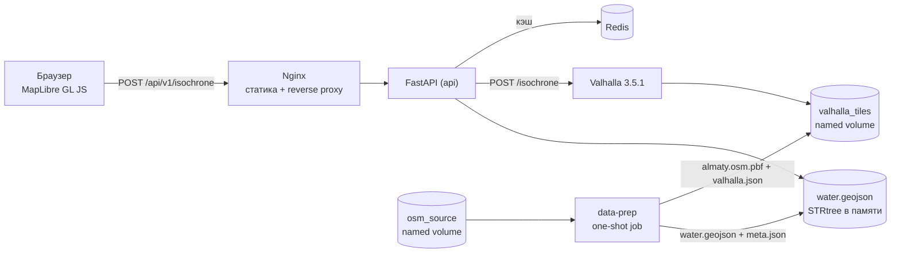

# Архитектура isochrone-service

Документ фиксирует ключевые решения, поток данных и точки расширения. Требования — в
`TZ-isochrone-service.md`, ссылки на пункты ТЗ приводятся в тексте.

---

## 1. Общая схема



Наружу публикуется единственный порт — `web` (`8080` по умолчанию). Valhalla, Redis и API
доступны только внутри сети compose (п. 10.6 ТЗ).

## 2. Поток обработки запроса

1. **Nginx** отдаёт статику либо проксирует `/api/*` и `/metrics` в FastAPI, проставляя
   `X-Forwarded-For`. Если API ещё не поднялся, `error_page 502 504` возвращает
   `503 ENGINE_UNAVAILABLE` в формате Problem Details, а не HTML-заглушку nginx.
2. **BodySizeLimitMiddleware** отсекает тела больше `MAX_BODY_SIZE`.
3. **RateLimitMiddleware** — token bucket на IP (`RATE_LIMIT`, `RATE_LIMIT_BURST`),
   `/health`, `/ready`, `/metrics` и документация исключены из лимита, иначе healthcheck
   контейнера съедал бы бюджет.
4. **RequestContextMiddleware** присваивает `request_id` (ULID; входящий `X-Request-Id`
   переиспользуется, если он безопасен), кладёт его в contextvar, ловит любые
   необработанные исключения и пишет единственную структурированную запись о запросе.
5. **Pydantic** валидирует тело или query-параметры. Нарушения → `400 VALIDATION_ERROR`,
   битый JSON → `400 MALFORMED_JSON`.
6. **IsochroneService**:
   - проверяет попадание точки в bbox покрытия → `422 POINT_OUT_OF_COVERAGE`;
   - подставляет `denoise`/`generalize` по максимальному контуру (таблица п. 6.6 ТЗ);
   - считает ключ кэша, при попадании отдаёт сохранённый ответ;
   - при промахе одним вызовом запрашивает у Valhalla **все контуры сразу**;
   - проверяет дистанцию привязки → `422 POINT_NOT_ROUTABLE`;
   - прогоняет геометрию через пайплайн (раздел 4);
   - кладёт стабильную часть ответа в кэш и возвращает результат.
7. Ответ уходит с `Content-Type: application/geo+json`, заголовками `X-Request-Id` и
   `X-Cache: HIT|MISS`.

## 3. Почему такие компоненты

**Valhalla** зафиксирован заказчиком (п. 4.3 ТЗ). Практические следствия, на которых
построен код: нативный `/isochrone`, несколько контуров за один вызов, вывод полигонов
GeoJSON, динамический costing — три режима работают на одном наборе тайлов, поэтому
`pedestrian`, `bicycle` и `auto` не требуют отдельного препроцессинга.

**Redis** — кэш, а не хранилище. Любая ошибка Redis деградирует сервис до режима «без
кэша» с записью `warning` в лог; после ошибки клиент на 5 секунд помечается пропускаемым,
чтобы не платить таймаут соединения на каждом запросе (п. 10.3 ТЗ, AC-12).

**Слой воды — файл, а не СУБД.** `data/water.geojson` загружается при старте и
индексируется `shapely.STRtree`. Для города это десятки тысяч полигонов: запрос по bbox
и вычитание укладываются в единицы миллисекунд, отдельная PostGIS не нужна.

**data-prep как отдельный one-shot сервис.** Требование «одной команды» (п. 11.1) означает,
что скачивание PBF, вырезка bbox и построение слоя воды должны происходить сами. Отдельный
контейнер с `osmium` + `gdal` + `shapely` делает это до старта Valhalla и завершается.
Идемпотентность обеспечивает `data_version` — sha1 от профиля, bbox, URL источника, даты
среза OSM и параметров воды. При совпадении подготовка пропускается, поэтому
`docker compose down && up` не вызывает пересборку тайлов (AC-16).

## 4. Геометрический пайплайн

Порядок операций подобран так, чтобы инварианты GEO-01…GEO-08 выполнялись
**по построению**, а не «обычно»:

1. **Парсинг** ответа движка: полигоны по значению `contour`, точка `snapped` из
   `show_locations`.
2. **Починка** — `is_valid` → `buffer(0)` → `make_valid`, затем отбрасывание неплощадных
   частей (GEO-01).
3. **Вложенность** — по возрастанию времени каждый контур объединяется с предыдущим.
   Генерализация применяется движком к каждому контуру независимо и изредка «подрезает»
   больший контур внутрь меньшего; объединение это чинит и гарантирует GEO-02 и GEO-03.
4. **Вычитание воды** — одинаково для всех контуров, поэтому вложенность сохраняется
   (GEO-07).
5. **Округление координат** до 6 знаков через `shapely.set_precision` с валидным выходом.
   Округление идёт **до** построения колец: разность двух геометрий, лежащих на одной
   сетке, точна, поэтому кольца получаются строго непересекающимися (GEO-05). Обратный
   порядок давал бы слепки-слайверы на границах.
6. **Кольца** (при `rings=true`) — разность соседних контуров.
7. **Площадь и периметр** — `pyproj.Geod.geometry_area_perimeter` по эллипсоиду WGS84,
   с учётом дырок и мультиполигонов, округление до 2 знаков (приложение Б ТЗ).
8. **Сборка Feature** в порядке убывания времени, цвет из фиксированной палитры
   ColorBrewer по позиции контура — цвета стабильны между запросами (FR-06, п. 6.2).

Ключевые метаданные дублируются в `properties` каждого `Feature`, потому что ГИС-редакторы
игнорируют foreign members верхнего уровня.

## 5. Кэширование

Ключ (п. 10.3 ТЗ):

```
sha1(round(lat,4), round(lon,4), mode, sorted(contours), denoise, generalize,
     rings, exclude_water, data_version, departure_time)
```

`departure_time` добавлен к перечню из ТЗ, потому что параметр реализован (FR-21) и влияет
на результат; без него разные запросы делили бы одну запись.

В кэш кладётся **стабильная** часть ответа: features и метаданные, не зависящие от
конкретного вызова. `request_id`, `computed_at`, `duration_ms` и `cache` подставляются при
отдаче, поэтому повторный запрос возвращает байт-в-байт ту же геометрию (GEO-08), но
корректную трассировку.

**Деградация без Redis.** «Сервис не падает при отказе кэша» недостаточно: с настройками
клиента по умолчанию каждый запрос платил бы секунды за попытку подключения, AC-12
формально проходил бы, а AC-09 падал на том же прогоне. Поэтому таймаут соединения задан
явно (`REDIS_CONNECT_TIMEOUT_MS`, 150 мс), а `CacheService` содержит circuit breaker: после
`REDIS_BREAKER_THRESHOLD` неудач подряд кэш исключается из обработки на
`REDIS_BREAKER_COOLDOWN_S`, после чего выполняется одна пробная попытка. WARNING пишется на
переходе состояния (`cache_unavailable` / `cache_recovered`), а не на каждом запросе, иначе
лог мёртвого Redis тонет в собственных сообщениях.

**Готовность движка.** `EngineMonitor` (`app/services/valhalla.py`) фоновым поллером с
интервалом `ENGINE_POLL_INTERVAL_S` держит состояние `preparing` / `ready` / `unavailable`.
Благодаря этому `503` отдаётся немедленно, а не после `ENGINE_TIMEOUT_S`, а текст `detail`
различает первичную сборку тайлов (с оценкой оставшегося времени) и отказ движка — на демо
это разница между «работает, ждём» и «сломано» (AC-25).

## 6. Модель ошибок

Единый источник истины — `ERROR_CATALOG` в `app/core/errors.py`: код → HTTP-статус,
заголовок, slug для `type`. Любая ошибка отдаётся как `application/problem+json` с
`request_id`. Стектрейсы и пути файловой системы наружу не попадают: необработанное
исключение логируется с `exc_info` и превращается в `500 INTERNAL_ERROR` с нейтральным
текстом (п. 10.6 ТЗ).

Ошибки движка транслируются по `error_code` Valhalla: `171`/`170`/`154` →
`422 POINT_NOT_ROUTABLE`, прочие 4xx → `400 VALIDATION_ERROR`, 5xx и сетевые сбои →
`503 ENGINE_UNAVAILABLE`, таймаут → `504 ENGINE_TIMEOUT`.

## 7. Наблюдаемость

**Логи** — JSON в stdout через `structlog` + `ProcessorFormatter`, так что записи uvicorn
тоже структурированы. На каждый запрос пишется ровно одна запись `http_request` с полями
`timestamp`, `level`, `request_id`, `method`, `path`, `status`, `duration_ms`, `engine_ms`,
`cache_hit`, `mode`, `contours`, `lat`, `lon`, `snap_distance_m` (п. 10.5 ТЗ).

Поля из обработчика попадают в запись через `structlog.contextvars`. Это работает потому,
что middleware написаны как «чистый» ASGI, а не на `BaseHTTPMiddleware`: обработчик
выполняется в том же таске, и contextvars видны после его завершения.

**Метрики** — `prometheus_client` на собственном реестре, `/metrics` в корне (проксируется
nginx): `isochrone_request_duration_seconds`, `isochrone_requests_total`,
`isochrone_engine_duration_seconds`, `isochrone_cache_hits_total` /
`isochrone_cache_misses_total`, плюс служебные `isochrone_cache_errors_total` и
`isochrone_rate_limited_total`.

## 8. Осознанные отклонения от ТЗ

### 8.1 Три противоречия ТЗ v1.0, разрешённые в v1.1

Реализация вскрыла три места, где ТЗ v1.0 противоречило собственным MUST-критериям
приёмки. Каждое разрешено в пользу критерия приёмки, ТЗ приведено в соответствие
(патч — `docs/patches/TZ-v1.0-to-v1.1.diff`). Это уже не отклонения: с версии 1.1 код
и ТЗ совпадают. Раздел сохранён как протокол решений.

| Пункт | Противоречие в v1.0 | Решение в v1.1 | Почему так |
|---|---|---|---|
| 11.2, 12 | dev-оверрайд назван `docker-compose.override.yml`, при этом AC-18 требует не публиковать наружу ничего, кроме `web` | файл переименован в `docker-compose.dev.yml`, подключается только явным `-f` | Compose подхватывает `override.yml` автоматически, поэтому обычный `docker compose up -d` публиковал бы порты api/valhalla/redis. Защита через `COMPOSE_FILE` в `.env` отклонена: `.env` нет в репозитории, пропуск `cp .env.example .env` возвращает небезопасное состояние, а переменная из шелла перекрывает файл молча. Небезопасная конфигурация должна быть недостижима, а не отключаться настройкой |
| 10.4 | `depends_on` с `condition: service_healthy` и одновременно требование отвечать `503 ENGINE_UNAVAILABLE` во время сборки тайлов | `condition: service_started`, готовность движка определяется на уровне приложения | с `service_healthy` контейнер `api` не стартовал бы до конца сборки тайлов, а `web` (nginx) с недоступным upstream не поднялся бы вовсе — имя резолвится на этапе загрузки конфига. Вместо `503` с Problem Details клиент получил бы неработающий контейнер |
| 6.4 | `/ready` отдаёт 503 при недоступности Redis, при этом AC-12 требует, чтобы остановка Redis не приводила к отказу | 503 только при недоступном движке; отказ кэша даёт `status: degraded` и `200` | `/ready` отвечает на вопрос «можно ли направлять сюда трафик». Кэш не обязательная зависимость: без него ответы корректны, теряется только скорость. Оркестратор различает состояния по HTTP-коду, мониторинг — по телу ответа |

Вторичные эффекты этих решений закрыты там же: короткий таймаут соединения с Redis и
circuit breaker (иначе AC-12 проходит, а AC-09 падает на том же прогоне — см. §5),
разнесённые таймауты connect/read для движка, фоновый поллер готовности
(`EngineMonitor`), требования к nginx (`proxy_read_timeout` > `ENGINE_TIMEOUT_S`,
рантайм-резолв upstream), автопроверка AC-18 в smoke-тесте и AC-25.

### 8.2 Действующие отклонения

| Пункт ТЗ | Как в ТЗ | Как реализовано | Почему |
|---|---|---|---|
| 10.4 | все контейнеры `restart: unless-stopped` | у `data-prep` — `restart: "no"` | это одноразовая job: с `unless-stopped` она перезапускалась бы бесконечно после успешного завершения |
| 13.1 | contract-тесты: фаззинг по OpenAPI | включён, но проверка `positive_data_acceptance` отключена | часть ограничений (диапазоны контуров, отсутствие дубликатов, попадание в bbox) невыразима в JSON Schema, и schemathesis считает корректный `400` ложным отказом. Проверки `not_a_server_error`, `status_code_conformance`, `content_type_conformance`, `response_schema_conformance` и `negative_data_rejection` работают |
| 12 | структура репозитория | добавлены `scripts/Dockerfile`, `scripts/prepare_data.sh`, `scripts/water_build.py`, `scripts/export_openapi.py`, `app/services/isochrone.py`, `app/services/dataset.py`, `app/core/middleware.py`, `app/core/ids.py`, `web/Dockerfile`, `web/render-config.sh`, `tests/support.py` | структура из ТЗ иллюстративная; добавленные файлы закрывают автоматизацию подготовки данных и разделение ответственности |

## 9. Конфигурация Valhalla

Образ `ghcr.io/gis-ops/docker-valhalla/valhalla:3.5.1` при первом старте генерирует
`valhalla.json`, а при `update_existing_config=True` дописывает недостающие ключи в
существующий файл, не трогая заданные. `data-prep` пользуется этим: кладёт в
`/custom_files/valhalla.json` минимальный фрагмент с
`service_limits.isochrone` (`max_contours`, `max_time_contour`, `max_distance_contour`,
`max_locations`), остальное заполняет сам образ. Так лимиты движка совпадают с лимитами API,
а `max_distance_contour` даёт рычаг для норматива на `auto 60` (п. 10.2 ТЗ).

`build_admins` и `build_time_zones` выключены: для покрытия одного города пересечение
административных границ и таймзон не влияет на маршрутизацию, а сборку заметно удлиняет.
Включаются переменными окружения сервиса `valhalla` при переходе на профиль `kazakhstan`.

## 10. Точки расширения

- **Новый режим передвижения.** Добавить значение в `TravelMode` и `COSTING_BY_MODE`
  (`app/config.py`). Тайлы пересобирать не нужно — costing у Valhalla динамический.
- **Новые классы барьеров.** Расширить список тегов в `scripts/prepare_water.sh` и, при
  необходимости, ширины буферов в `.env`. Код API не меняется.
- **Другой роутинг-движок.** Реализовать интерфейс `ValhallaClient.isochrone/status/version`
  и функции `build_*_payload` / `parse_*_response` в новом модуле `app/services/`.
  Остальной пайплайн от движка не зависит.
- **Общий rate limit на несколько реплик API.** Заменить in-memory bucket в
  `app/core/middleware.py` на счётчик в Redis; интерфейс `_allow()` останется тем же.
- **Аутентификация.** Точка врезки — отдельный ASGI-middleware перед `RateLimitMiddleware`;
  формат ошибок уже соответствует RFC 7807, добавится код `UNAUTHORIZED`.
- **Дополнительные форматы вывода (TopoJSON, WKT).** Отдельный `response_class` и
  content negotiation в `app/routers/isochrone.py`; геометрия уже готова в shapely.

## 11. Структура кода

```
api/app/
├── main.py               приложение, lifespan, middleware, обработчики ошибок, OpenAPI
├── config.py             Settings, профили bbox, палитра, таблица сглаживания
├── schemas.py            Pydantic-модели запроса, ответа, ошибок, служебных эндпоинтов
├── routers/
│   ├── isochrone.py      POST и GET /isochrone, документация ответов
│   └── system.py         /health, /ready, /meta, /metrics
├── services/
│   ├── valhalla.py       HTTP-клиент движка, сборка payload, разбор ответа, коды ошибок
│   ├── geometry.py       починка, вложенность, кольца, вода (STRtree), площади, округление
│   ├── cache.py          ключ кэша, Redis с деградацией
│   ├── dataset.py        чтение data/meta.json: bbox, дата среза, data_version
│   └── isochrone.py      оркестрация: покрытие, кэш, движок, пайплайн, сборка ответа
└── core/
    ├── logging.py        structlog, JSON в stdout, contextvar с request_id
    ├── errors.py         RFC 7807: каталог ошибок и обработчики
    ├── metrics.py        реестр и метрики Prometheus
    ├── middleware.py     request context, лимит тела, rate limit (чистый ASGI)
    └── ids.py            генерация и санитизация request_id (ULID)
```
